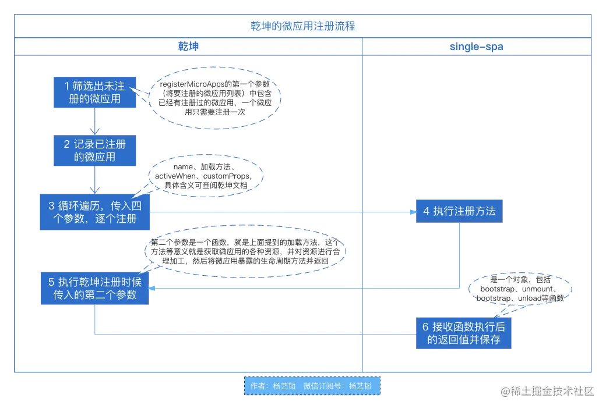
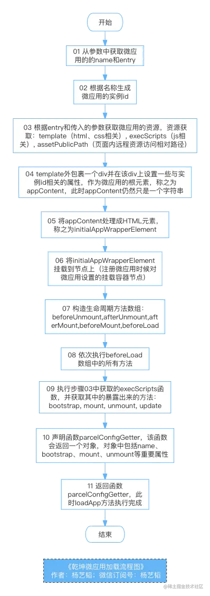

# 02.乾坤的微应用加载流程分析(从微应用的注册到loadApp方法内部实现)
> 我们在[微前端01 : 乾坤的Js隔离机制原理剖析（快照沙箱、两种代理沙箱）](./01.乾坤的Js隔离机制原理剖析（快照沙箱、两种代理沙箱）.md)一文中提到过，乾坤建立在**single-spa**的基础上，相对于**single-spa**，乾坤主要完成了两件事，微应用的加载和资源隔离。本文主要探讨乾坤中微应用的加载过程。


```ts
/******************************************************************/
/*****************     欢迎关注微信公众号：杨艺韬     *****************/
/******************************************************************/
```

乾坤的微应用加载流程主要触发场景包括下面四个：
 - 通过`registerMicroApps`注册微应用
 - 通过`loadMicroApp`手动加载微应用
 - 调用`start`时触发了预加载逻辑
 - 手动调用`prefetchApps`执行预加载
 
其实不管通过什么场景触发微应用加载逻辑，进行微应用加载本身的执行方法都只有一个，那就是位于`src/loaser.ts`文件中的`loadApp`方法。为了方便大家理解，认识微应用加载逻辑在乾坤中的位置，我将主要触发场景列在上面，关于上面列出的方法，都是乾坤暴露出来的api，可以在乾坤文档上查阅到相关用途。本文会以具体的乾坤微应用的注册流程开始，进而引出`loadApp`方法中的实现细节。在介绍`loadApp`实现细节的过程中，我会先分析乾坤加载微应用的主体流程和关键环节。在大家对主流程了解的基础上，将其中需要注意的关键点，分成多个小节进行介绍。但对于一些内容可能会比较多的细节，我们会再用新的文章来进行详细分析。比如在[微前端01 : 乾坤的Js隔离机制原理剖析（快照沙箱、两种代理沙箱）](./01.乾坤的Js隔离机制原理剖析（快照沙箱、两种代理沙箱）.md)提到的三种沙箱，我们当时分析了其核心原理，但它们是如何在乾坤中的发挥作用的当时并没有提及，虽然微应用加载流程和沙箱机制有比较强的关联，但该部分内容又相对较多，所以我们会在后续的文章中结合沙箱相关代码和加载流程相关代码进行详细介绍。具体内容请见下文。
# 乾坤的微应用注册流程
请先看下图：


从图中我们可以看出两个重要的点，分别对应流程图中的第4步和第5步：
- 微应用的注册，实际上发生在**single-spa**中
- 子应用暴露的生命周期函数，由乾坤提供的函数参数返回
```js
// 代码片段一，所属文件: src/apis.ts
export function registerMicroApps<T extends ObjectType>(
  apps: Array<RegistrableApp<T>>,
  lifeCycles?: FrameworkLifeCycles<T>,
) {
  // 这里省略了其他代码...
  unregisteredApps.forEach((app) => {
    const { name, activeRule, loader = noop, props, ...appConfig } = app;
    registerApplication({//关键点1
      name,
      app: async () => {// 关键点2
        // 这里省略了其他代码...
        const { mount, ...otherMicroAppConfigs } = (
          // 关键点4
          await loadApp({ name, props, ...appConfig }, frameworkConfiguration, lifeCycles)
        )();
        return {// 关键点3
          mount: [async () => loader(true), ...toArray(mount), async () => loader(false)],
          ...otherMicroAppConfigs,
        };
      },
      activeWhen: activeRule,
      customProps: props,
    });
  });
}

```
下面我们先了解上面代码片段中的一些关键信息：
## 关于single-spa在这里发挥的作用
从上面代码片段中的**关键点1**处可以直观的看出，真正发起注册微应用的方法是`registerApplication`方法，而该方法是从**single-spa**中导入的。这映照了我们前面说过的，乾坤是建立在**single-spa**之上的。大家想一想，如果没有乾坤，直接使用**single-spa**是不是也可以让我们的项目具备接入微应用的能力呢？答案是肯定的。只不过乾坤在这里进行的资源加载以及资源隔离工作需要我们自己编码实现。到这里大家会不会有所启发，增强那些成熟但不够强大的开源库，可以让我们事半功倍，既避免重复又提高了工作效率。同时这也为那些想参与开源贡献但又无从下手的朋友，提供了一个思路。
## 关于微应用加载函数的返回值
上面代码片段中注释**关键点2**处指示的微应用加载函数，对应了流程图中的**第5步**，最核心的逻辑是代码注释**关键点4**所指示的`loadApp`方法（其他逻辑我们先忽略暂不关心，本文后续部分会在恰当的时机提到）。上文流程图中的**第5步**，对应上文代码片段中的**关键点3**。当**关键点2**处的app方法执行，返回了**关键点3**处的对象，该对象包括了`mount、name、bootstrap、unmount`等属性，这些属性其实就是**single-spa**注册微应用时候所需要的内容，因为**single-spa**中所谓的注册微应用，本质上就是获取微应用暴露的相关生命周期方法，在后续程序运转过程中，通过控制这些生命周期方法，进而实现对微应用的控制。

接下来，我们就把目光投向`loadApp`内部中去，微应用的加载，核心逻辑都在这里，这也是本文的主题，请看下文。
# loadApp的内部实现
## loadApp的主体流程
请先简单看一下流程图：



从图中可以看出，`loadApp`内部逻辑比较复杂，在忽略一些细节的情况下，大体上有**11**个主要步骤。由于图中的流程是代码执行流程，初次阅读可能不容易理解，但不要紧，下面的章节会结合代码逐步进行解析其中的细节。在深入细节之前，请大家要明白`loadApp`的核心功能：那就是获取微应用的**js/css/html**等资源，并对这些资源进行加工，随后会构造和执行一生命周期中需要执行的方法，最终返回一个函数，而这个函数的返回值是一个对象，该对象包括了微应用的生命周期方法。有了这个最基本的认识，我们就可以进行下面的详细解读了。
## loadApp中值得关注的细节
### 关于获取微应用资源的方法
关于微应用资源的获取，对应流程图中的**第3步**，具体功能实现依赖了库`import-html-entry`中的`importEntry`函数，这个函数解决了两个问题，**一**是如何把资源获取到本地，**二**是如何将这些进行恰当处理以满足实际需要。关于这个库的具体实现，如何获取资源，如何处理资源，我会在后续出一篇单独的文章进行讲解，敬请朋友们期待。调用该函数的对应代码如下：
```javascript
  // 代码片段二，对应文件：src/loader.ts
  const { template, execScripts, assetPublicPath } = await importEntry(entry, importEntryOpts);
  /**
   * 先对这几个变量有个简单的了解，后续在合适的地方会详细介绍
   * template: 一个字符串，内部包含了html、css资源
   * execScripts：一个函数，执行该函数后会返回一个对象
   * assetPublicPath：访问页面远程资源的相对路径
   * /
```
### 将获取到的template(涉及html/css)转化成DOM节点
代码片段二中我们提到，`template`是一个字符串，为什么是一个字符串呢，其实很简单，资源以字节流的形式从网络上到达本地后只能转化成字符串进行处理。我们这里需要把字符串转化成具体可用的Dom节点。那怎么转化？具体代码涉及两部分：
```javascript
// 代码片段三，对应文件：src/loader.ts
const appContent = getDefaultTplWrapper(appInstanceId)(template);
let initialAppWrapperElement: HTMLElement | null = createElement(
    appContent,
    strictStyleIsolation,
    scopedCSS,
    appInstanceId,
  );
```
```javascript
// 代码片段四，对应文件：src/utils.ts
export function getDefaultTplWrapper(name: string) {
  return (tpl: string) => `<div id="${getWrapperId(name)}" data-name="${name}" data-version="${version}">${tpl}</div>`;
}
```
代码片段三中的`appContent`对应流程图中第**4**步提到的`appContent`。代码片段中三中的`initialAppWrapperElement`就是流程图中第**5**步提到的DOM元素`initialAppWrapperElement`。从代码中可以看出，函数`getDefaultTplWrapper`中对获取到的`template`外层包裹一个`div`，在该`div`上设置`id、data-name、data-version`等属性。为什么要包裹这样一个标签呢？在我看来有两个好处，**第一**是能够保证`template`转化为DOM节点后的根节点只有一个，这样将来对微应用挂载、卸载等操作的时候能够保证准确性；**第二**是在该标签上设置具有标识性的属性，可以避免与微应用原有的根元素上的属性冲突。
> 有没有发现这里的`getDefaultTplWrapper`方法实际上什么都没做，只是返回了一个函数，那这样的意义是什么呢，这种机制可以避免反复传递参数`name`。其实这是一个我们在日常编写代码的过程中可以借鉴的点，在需要频繁传递的某些参数而这些参数又不经常变化的情况下，特别是还要对这些参数进行处理的情况下，可以通过这种方式对程序进行优化。一方面可以让调用函数的时候参数更精简，同时也避免了重复对这些参数进行处理。这就是我们常常说的函数的颗粒化，很好地利用了闭包的机制。说到这，我想表达一个自己由来已久的观点：**世界上没有技术高手，只有基本功扎实的开发者**。我把这句话分享给大家，希望和大家一道夯实基础，在技术的道路上越走越远。

接下来，我们如何将字符串`appContent`转化成DOM节点`initialAppWrapperElement`呢，这有赖于片段三中的所示的`createElement`方法，该方法代码如下：
```javascript
// 代码片段四，所属文件：src/loader.ts
function createElement(
  appContent: string,
  strictStyleIsolation: boolean,
  scopedCSS: boolean,
  appInstanceId: string,
): HTMLElement {
  const containerElement = document.createElement('div');
  containerElement.innerHTML = appContent;
  // appContent always wrapped with a singular div
  const appElement = containerElement.firstChild as HTMLElement;
  // 省略了其他代码...
  return appElement;
}
```
代码片段四中的关键是，先创建一个空`div`，名为`containerElement`，然后将其内容设置为上文提到的`appContent`，再获取`containerElement`的第一个子元素，作为将要返回的DOM元素，当然还需要对这个DOM元素进行一些处理，这里省略了相关代码。这样做有什么作用呢，看见上面的那行注释`appContent always wrapped with a singular div`。其实就是如果`appContent`有多个根节点，那么这里只会获取和应用第一个节点。如果在日常代码编写过程中有相同的场景，我认为可以直接复用这三行代码。
### css资源的处理和隔离方法
代码片段四中省略了下面这几行代码。这几行代码的作用是对`appElement`中的**style**进行处理，限于篇幅，具体怎么处理这些**style**我们这里先不关心，后续我们用专门的文章来进行详细解析，敬请朋友们期待。
```javascript
if (scopedCSS) {
    const attr = appElement.getAttribute(css.QiankunCSSRewriteAttr);
    if (!attr) {
      appElement.setAttribute(css.QiankunCSSRewriteAttr, appInstanceId);
    }
    const styleNodes = appElement.querySelectorAll('style') || [];
    forEach(styleNodes, (stylesheetElement: HTMLStyleElement) => {
      css.process(appElement!, stylesheetElement, appInstanceId);
    });
  }
```
### 关于shadow dom的陷阱
其实在代码片段四中还省略了下面几行代码：
```javascript
if (strictStyleIsolation) {
    if (!supportShadowDOM) {
      console.warn(
        '[qiankun]: As current browser not support shadow dom, your strictStyleIsolation configuration will be ignored!',
      );
    } else {
      const { innerHTML } = appElement;
      appElement.innerHTML = '';
      let shadow: ShadowRoot;
      if (appElement.attachShadow) {
        shadow = appElement.attachShadow({ mode: 'open' });
      } else {
        // createShadowRoot was proposed in initial spec, which has then been deprecated
        shadow = (appElement as any).createShadowRoot();
      }
      shadow.innerHTML = innerHTML;
    }
```
这几行代码的主要功能，就是如果是严格的样式隔离，那么就判断当前环境是否支持**shadow dom**，在支持**shadow dom**的情况下，则将元素绑定到**shadow dom**上。至于**shadow dom**是什么，限于篇幅不在这里解释。如果有朋友查阅资料后还是不清楚可以留言交流。不过这里需要指出的是，**shadow dom**虽然可以做到很好的隔离，但是有个问题需要大家关注。那就是元素在**shadow dom**中是自治的，外界无法影响。但如果该元素挂载到了**shadow dom**外部，则无法正常运行。比如React中的很多弹框，都是直接挂载到`body`上的，那这种情况下就要采取措施进行规避。乾坤在关于start方法到api文档中提到了下面内容：
> 基于 ShadowDOM 的严格样式隔离并不是一个可以无脑使用的方案，大部分情况下都需要接入应用做一些适配后才能正常在 ShadowDOM 中运行起来（比如 [react 场景下](https://github.com/facebook/react/issues/10422) 需要解决这些 问题，使用者需要清楚开启了 `strictStyleIsolation` 意味着什么。后续 `qiankun` 会提供更多官方实践文档帮助用户能快速地将应用改造成可以运行在 `ShadowDOM` 环境的微应用。
### 关于函数initialAppWrapperGetter
该函数存在于，流程图中的第**6**步和第**7**步之间。朋友们有没有觉得奇怪，我们上文已经得到了微应用的DOM元素`initialAppWrapperElement`，为什么又出现一个函数来获取微应用的DOM元素？
```javascript
// 代码片段五，所属文件：src/loader.ts
  const initialAppWrapperGetter = getAppWrapperGetter(
    appInstanceId,
    !!legacyRender,
    strictStyleIsolation,
    scopedCSS,
    () => initialAppWrapperElement,
  );
  /** generate app wrapper dom getter */
function getAppWrapperGetter(
  appInstanceId: string,
  useLegacyRender: boolean,
  strictStyleIsolation: boolean,
  scopedCSS: boolean,
  elementGetter: () => HTMLElement | null,
) {
  return () => {
    if (useLegacyRender) {
      // 省略一些代码...
      const appWrapper = document.getElementById(getWrapperId(appInstanceId));
      // 省略一些代码...
      return appWrapper!;
    }
    const element = elementGetter();
      // 省略一些代码
    return element!;
  };
}
```
从上面的代码片段五中，我们其实可以看到之所以存在这个`getAppWrapperGetter`方法，是为了兼容过去可以自定义渲染函数的机制，这里我们先不提这个渲染机制，可以简单理解为把一个DOM节点挂载到某个DOM节点上。这也提醒我们，在设计一个系统的时候一定要慎重，否则为了兼容低版本能正常运行，而不得不经常做一些类似的兼容措施。如果乾坤一开始就没有设计这个`legacyRender`这种机制，那么`getAppWrapperGetter`也就没有存在的必要，整个系统的程序可读性和易用性都会提升。当然乾坤作为一个优秀的微前端框架，也是逐步在发展进化，兼容低版本的行为难以避免。
### 沙箱机制的应用
我们在上一篇文章分析了乾坤中的三种沙箱机制的核心原理。但是只了解原理还不够，我们还得在程序中具体使用才能发挥作用。鉴于对沙箱的具体应用涉及的代码还不少，不方便在本文进行详细阐述。我会在后续单独写一篇文章进行解析。这里只做简要介绍，涉及代码如下：
```javascript
// 代码片段六，所属文件：src/loader.ts
let global = globalContext;
  let mountSandbox = () => Promise.resolve();
  let unmountSandbox = () => Promise.resolve();
  const useLooseSandbox = typeof sandbox === 'object' && !!sandbox.loose;
  let sandboxContainer;
  if (sandbox) {
    sandboxContainer = createSandboxContainer(
      appInstanceId,
      // FIXME should use a strict sandbox logic while remount, see https://github.com/umijs/qiankun/issues/518
      initialAppWrapperGetter,
      scopedCSS,
      useLooseSandbox,
      excludeAssetFilter,
      global,
    );
    global = sandboxContainer.instance.proxy as typeof window;
    mountSandbox = sandboxContainer.mount;
    unmountSandbox = sandboxContainer.unmount;
  }
```
这部分代码在流程图中第**6**步和第**7**步之间。我认为里面最核心的那行代码是`global = sandboxContainer.instance.proxy as typeof window;`，因为后续该微应用中进行的操作，都是这个沙箱容器中的沙箱代理对象在发挥作用。详细内容后续新文章进行解析，这里只是先提到一下，大概有个印象，如果不理解沙箱容器、沙箱代码对象这些名词也没关系，可以先跳过。
### 一些生命周期中需要执行的函数
```javascript
// 代码片段七，所属文件：src/loader.ts
const {
  beforeUnmount = [],
  afterUnmount = [],
  afterMount = [],
  beforeMount = [],
  beforeLoad = [],
} = mergeWith({}, getAddOns(global, assetPublicPath), lifeCycles, (v1, v2) => concat(v1 ?? [], v2 ?? []));
```
代码片段七，对应流程图中的第**7**步，这些数组对象`beforeUnmount、afterUnmount、afterMount、beforeMount、beforeLoad`中会保存很多函数，这些函数会放到某些合适的时机去执行。那什么是合适的时机呢？上文我们提到过，微应用会暴露生命周期方法，**single-spa**会通过调用这些生命周期方法来控制微应用的状态。代码片段七中的这些方法，就会放到生命周期方法中去，本文在后续部分会再次提到。至于这里的`mergeWith、getAddOns`方法的具体执行和内容，因为里面内容不太多，朋友们可以自行阅读，如果阅读后有不理解的内容，可以留言沟通。
### 关于数组的reduce方法的妙用：execHooksChain
代码片段七执行完后，紧接着有一行代码：
```javascript
await execHooksChain(toArray(beforeLoad), app, global);
```
我们先不关心`beforeLoad`中具体有哪些方法，具体有哪些方法由代码片段七决定。我们现在只看`execHooksChain`这个函数：
```javascript
// 代码片段八，所属文件：src/loader.ts
function execHooksChain<T extends ObjectType>(
  hooks: Array<LifeCycleFn<T>>,
  app: LoadableApp<T>,
  global = window,
): Promise<any> {
  if (hooks.length) {
    return hooks.reduce((chain, hook) => chain.then(() => hook(app, global)), Promise.resolve());
  }

  return Promise.resolve();
}
```
这里巧妙的利用了数组的`reduce`函数，试想如果不这样写应该怎么做实现相同的功能呢，我想应该是这样：
```javascript
// 代码片段九
for(let i = 0; i < hooks.length; i++){
  await hooks[i](app, global);
}
```
要实现相同功能，其实两种方式都可以，朋友们可以自行选用，但如果基础不扎实，对`reduce`方法了解的不那么清楚，可能第一次读相关代码会比较吃力，我写的代码片段九，可以帮助基础不扎实的朋友理解代码片段八实现的功能。
### 微应用加载完成后的返回值
微应用加载流程执行完成返回的是一个函数，如代码所示：
```javascript
  const parcelConfigGetter: ParcelConfigObjectGetter = (remountContainer = initialContainer) => {
    // 省略相关代码
    const parcelConfig: ParcelConfigObject = {
      // 省略相关代码
    }
    return parcelConfig;
  }
```
我们可能第一反应是，既然加载完成了，为什么不直接返回相关内容，反而返回一个函数呢？其实答案就在这个函数的参数`remountContainer`里面，因为这个返回的对象实际上就是**single-spa**需要的微应用暴露的的生命周期函数。我们知道微应用的生命周期方法中有`mount`，我们的微应用最终要挂载到某个地方去，正常情况下就是用户注册微应用时候传入的`container`参数。但是如果注册完成后，微应用需要挂载到别的地方去怎么办呢，因此这里返回值就是一个函数，而非直接返回对象。
### parcelConfigGetter的返回对象
```javascript
const parcelConfig: ParcelConfigObject = {
      name: appInstanceId,
      bootstrap,
      mount: [
        async () => {
          if (process.env.NODE_ENV === 'development') {
            const marks = performanceGetEntriesByName(markName, 'mark');
            // mark length is zero means the app is remounting
            if (marks && !marks.length) {
              performanceMark(markName);
            }
          }
        },
        async () => {
          if ((await validateSingularMode(singular, app)) && prevAppUnmountedDeferred) {
            return prevAppUnmountedDeferred.promise;
          }

          return undefined;
        },
        // initial wrapper element before app mount/remount
        async () => {
          appWrapperElement = initialAppWrapperElement;
          appWrapperGetter = getAppWrapperGetter(
            appInstanceId,
            !!legacyRender,
            strictStyleIsolation,
            scopedCSS,
            () => appWrapperElement,
          );
        },
        // 添加 mount hook, 确保每次应用加载前容器 dom 结构已经设置完毕
        async () => {
          const useNewContainer = remountContainer !== initialContainer;
          if (useNewContainer || !appWrapperElement) {
            // element will be destroyed after unmounted, we need to recreate it if it not exist
            // or we try to remount into a new container
            appWrapperElement = createElement(appContent, strictStyleIsolation, scopedCSS, appInstanceId);
            syncAppWrapperElement2Sandbox(appWrapperElement);
          }

          render({ element: appWrapperElement, loading: true, container: remountContainer }, 'mounting');
        },
        mountSandbox,
        // exec the chain after rendering to keep the behavior with beforeLoad
        async () => execHooksChain(toArray(beforeMount), app, global),
        async (props) => mount({ ...props, container: appWrapperGetter(), setGlobalState, onGlobalStateChange }),
        // finish loading after app mounted
        async () => render({ element: appWrapperElement, loading: false, container: remountContainer }, 'mounted'),
        async () => execHooksChain(toArray(afterMount), app, global),
        // initialize the unmount defer after app mounted and resolve the defer after it unmounted
        async () => {
          if (await validateSingularMode(singular, app)) {
            prevAppUnmountedDeferred = new Deferred<void>();
          }
        },
        async () => {
          if (process.env.NODE_ENV === 'development') {
            const measureName = `[qiankun] App ${appInstanceId} Loading Consuming`;
            performanceMeasure(measureName, markName);
          }
        },
      ],
      unmount: [
        async () => execHooksChain(toArray(beforeUnmount), app, global),
        async (props) => unmount({ ...props, container: appWrapperGetter() }),
        unmountSandbox,
        async () => execHooksChain(toArray(afterUnmount), app, global),
        async () => {
          render({ element: null, loading: false, container: remountContainer }, 'unmounted');
          offGlobalStateChange(appInstanceId);
          // for gc
          appWrapperElement = null;
          syncAppWrapperElement2Sandbox(appWrapperElement);
        },
        async () => {
          if ((await validateSingularMode(singular, app)) && prevAppUnmountedDeferred) {
            prevAppUnmountedDeferred.resolve();
          }
        },
      ],
    };
```
会发现这个返回的对象有很多内容，但是我们可以从宏观的视角来看，该对象只有**4**个属性，`name、bootstrap、mount、unmount`，没错这正是**single-spa**需要微应用暴露的生命周期函数。后续就是通过执行对应生命周期函数而控制微应用。因为这里相当于微应用加载的最终结果，汇聚了大量其他逻辑产生了这样一个结果对象。我不打算立即对这些函数进行逐一解析，因为内容比较零碎，如果逐一讲解不利于大家理解。所以后续文章会先逐个介绍本文尚未详细介绍的部分，在比较全面的了解乾坤后，我们会深入到**single-spa**，那时候会用到这些方法，我们再找合适的机会来详细讲解这里的众多方法。
### 关于Promise的妙用：Deferred
此时`loadApp`已经执行完成，返回了一个函数`parcelConfigGetter`，我们把视野移动到调用`loadApp`的地方，也就是本文的代码片段一。但代码片段一省略了我现在要讲的代码，请看这里：
```javascript
registerApplication({
      name,
      app: async () => {
        // 省略代码...
        await frameworkStartedDefer.promise;
        const { mount, ...otherMicroAppConfigs } = (
          await loadApp({ name, props, ...appConfig }, frameworkConfiguration, lifeCycles)
        )();
        // 省略代码....
      },
```
有没有觉得有行代码很奇怪，那就是`await frameworkStartedDefer.promise;`，其实这行代码是与下面的代码片段配合使用的：
```javascript
// 所属文件：src/apis.ts
export function start(opts: FrameworkConfiguration = {}) {
  // 省略了其他代码...
  frameworkStartedDefer.resolve();
}
```
那这个`frameworkStartedDefer`到底是什么呢？
```javascript
// 所属文件：src/apis.ts
const frameworkStartedDefer = new Deferred<void>();
// 所属文件：src/utils.ts
export class Deferred<T> {
  promise: Promise<T>;
  resolve!: (value: T | PromiseLike<T>) => void;
  reject!: (reason?: any) => void;
  constructor() {
    this.promise = new Promise((resolve, reject) => {
      this.resolve = resolve;
      this.reject = reject;
    });
  }
}
```
通过控制一个`Promise`的`resolve`和`reject`方法，来控制分属于两个不同方法中代码的执行顺序，很巧妙。在日常开发中如果有类似场景，可以借鉴。
# 小结
本文介绍了乾坤微应用的注册流程，并由微应用的注册流程，引出了微应用的加载流程，我们对微应用的加载流程中的一些关键的环节进行了剖析。由于还有些细节的内容较多，难以在本文全部展开介绍，我将会在以新的文章的形式来具体剖析，敬请读者朋友们期待。朋友们也可对自己感兴趣的点在留言区提出来，我将在后续的文章中考虑呈现相关主题的内容。

欢迎关注我的`微信订阅号`：`杨艺韬`，可以获取我的最新动态。