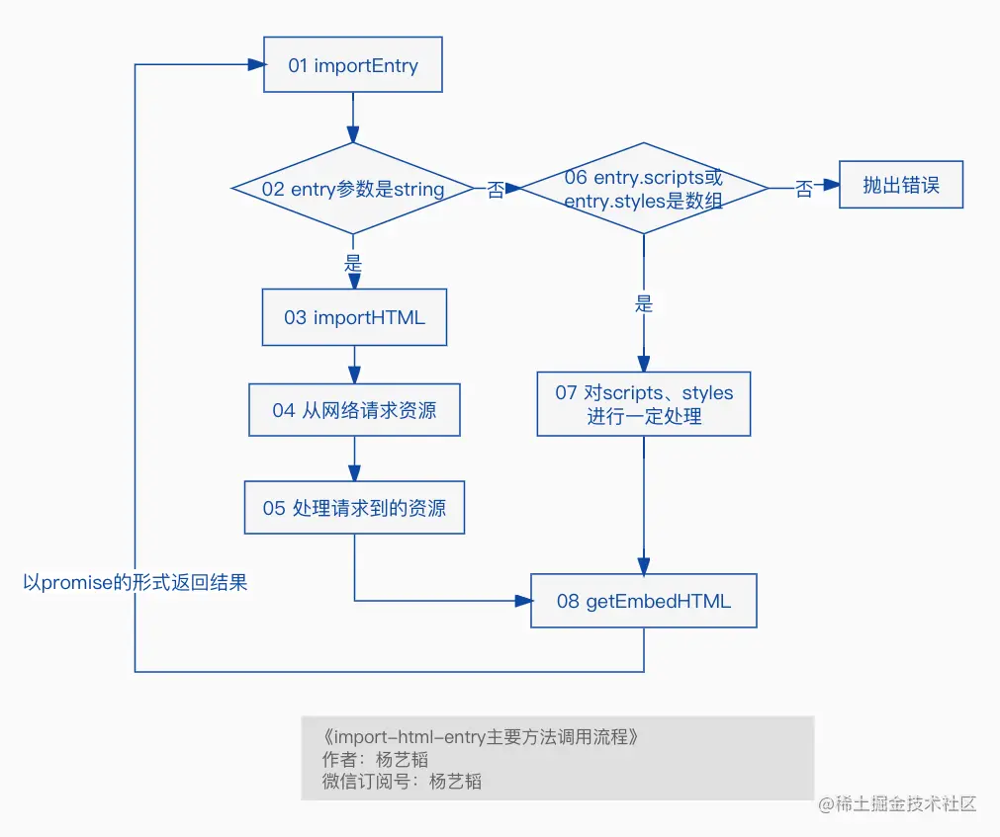

# 04.乾坤的资源加载机制(import-html-entry的内部实现)

```ts
/******************************************************************/
/*****************     欢迎关注微信公众号：杨艺韬     *****************/
/******************************************************************/
```

>我们在前面的文章**乾坤的微应用加载流程分析(从微应用的注册到loadApp方法内部实现)**提到过，加载微应用的时候要获取微应用的`js、css、html`等资源，但是具体怎么获取的当时并没有讲。还记得在`loadApp`中执行了这一行代码：
```javascript
const { template, execScripts, assetPublicPath } = await importEntry(entry, importEntryOpts);
```

> 这里的`importEntry`来自于一个依赖库`import-html-entry`，接下来我们将从`importEntry`开始，探索整个`import-html-entry`都做了些什么。

我们先来看一张流程图：



接下来我会根据流程图的顺序依次对其中重要环节依次进行讲解，请看下文。
## importEntry
我们先来看看`importEntry`函数接收了哪些参数以及参数对应的含义：
```javascript
// 代码片段1，所属文件：src/index.js
export function importEntry(entry, opts = {}) {
	const { fetch = defaultFetch, getTemplate = defaultGetTemplate, postProcessTemplate } = opts;
	const getPublicPath = opts.getPublicPath || opts.getDomain || defaultGetPublicPath;
	// 省略一些不太关键的代码...
	if (typeof entry === 'string') {
		return importHTML(entry, {
			fetch,
			getPublicPath,
			getTemplate,
			postProcessTemplate,
		});
	}
    // 此处省略了许多代码... 占位1
}
```
我们这里先对`importEntry`的功能和参数类型提前有个了解：
>**功能**
> - 加载`css/js`资源，并且将加载的资源嵌入到`html`中去；
> - 获取`scripts`资源上的`exports`对象
>
>**类型**
> - Entry（参数`entry`的类型，必传）：
    > `string | { styles?: string[], scripts?: string[], html?: string }`
    > 如果类型为`string`，`importEntry`将会调用`importHTML`执行相关逻辑，否则，就会加载`styles`、`scripts`所对应的资源并嵌入到字符串`html`中，注意这里是字符串，这区别于流程图中对应的第**3**步所提到的加载远程的`html`资源。另外需要了解，这里的参数`styles`对应的是`style`资源的`url`数组，与之类似，`scripts`参数对应的是`js`资源的`url`数组。而参数`html`就是一个字符串，是一个`html`页面的具体内容。
> - **ImportEntryOpts**（参数`opts`的类型，可选）：
>    - **fetch**: 自定义的加载资源的方法，可选，类型为`typeof window.fetch | { fn?: typeof window.fetch, autoDecodeResponse?: boolean }`，其中的`autoDecodeResponse` 可选，当字符集不是`utf-8`（比如`gbk`或`gb2312`）的时候自动解码，默认值为`false`。
>    - **getPublicPath**：类型为`(entry: Entry) => string`，自定义的资源访问的相对路径，可选。
>    - **getTemplate**：类型为`(tpl: string) => string`,自定义的`HTML`资源预处理的函数，可选。

到这里，相信朋友们已经能能够理解了代码片段**1**中的函数参数了，接下来，我们就进入到函数`importHTML`中去。
## importHTML
在进入`importHTML`之前，希望大家能够知道`importHTML`函数的参数和`importEntry`是一致的，后面不再赘述，我们先看看该函数的整体结构：
```javascript
// 代码片段2，所属文件：src/index.js
export default function importHTML(url, opts = {}) {
	// 这里省略许多代码... 占位1
	return embedHTMLCache[url] || (embedHTMLCache[url] = fetch(url)
		.then(response => readResAsString(response, autoDecodeResponse))
		.then(html => {
			const assetPublicPath = getPublicPath(url);
			const { template, scripts, entry, styles } = processTpl(getTemplate(html), assetPublicPath, postProcessTemplate);
			return getEmbedHTML(template, styles, { fetch }).then(embedHTML => ({
				template: embedHTML,
				assetPublicPath,
				getExternalScripts: () => getExternalScripts(scripts, fetch),
				getExternalStyleSheets: () => getExternalStyleSheets(styles, fetch),
				execScripts: (proxy, strictGlobal, execScriptsHooks = {}) => {
					if (!scripts.length) {
						return Promise.resolve();
					}
					return execScripts(entry, scripts, proxy, {
						fetch,
						strictGlobal,
						beforeExec: execScriptsHooks.beforeExec,
						afterExec: execScriptsHooks.afterExec,
					});
				},
			}));
		}));
}
```
为了方便理解，我们省略了部分代码，代码片段**2**中的占位**1**主要是对传入的参数做了些预处理。
>这里简单提一下，`embedHTMLCache[url] || (embedHTMLCache[url] = fetch(url)`这种使用缓存和给缓存赋值的方式，在日常开发中可以借鉴。


`importHTML`核心作用有三个：
- 调用`fetch`请求`html`资源（注意，不是`js、css`资源）；
- 调用`processTpl`处理资源；
- 调用`getEmbedHTML`对`processTpl`处理后的资源中链接的远程`js、css`资源取到本地并嵌入到`html`中 。

至于请求`html`资源，主要是`fetch`方法的调用，不在此过多描述。下面主要讲一讲`processTpl`和`getEmbedHTML`两个函数。
## processTpl
关于`processTpl`的代码，我不打算逐行进行分析，相反我会讲其中一个原本不应该是重要的点,那就是其中涉及到的**正则表达式**，这部分虽然看起来很基础，但实际上是理解函数`processTpl`的关键所在。我将在下面代码片段中注释上各个正则表达式可能匹配的内容，再整体描述一下主要逻辑，有了这些介绍，相信朋友们可以自己读懂该函数剩下的代码。
```javascript
// 代码片段3，所属文件：src/process-tpl.js
/*
  匹配整个script标签及其包含的内容，比如 <script>xxxxx</script>或<script xxx>xxxxx</script>

  [\s\S]    匹配所有字符。\s 是匹配所有空白符，包括换行，\S 非空白符，不包括换行
  *         匹配前面的子表达式零次或多次
  +         匹配前面的子表达式一次或多次

  正则表达式后面的全局标记 g 指定将该表达式应用到输入字符串中能够查找到的尽可能多的匹配。
  表达式的结尾处的不区分大小写 i 标记指定不区分大小写。   
*/
const ALL_SCRIPT_REGEX = /(<script[\s\S]*?>)[\s\S]*?<\/script>/gi;
/*
    . 匹配除换行符 \n 之外的任何单字符
    ? 匹配前面的子表达式零次或一次，或指明一个非贪婪限定符。

    圆括号会有一个副作用，使相关的匹配会被缓存，此时可用 ?: 放在第一个选项前来消除这种副作用。
    其中 ?: 是非捕获元之一，还有两个非捕获元是 ?= 和 ?!， ?=为正向预查，在任何开始匹配圆括
    号内的正则表达式模式的位置来匹配搜索字符串，?!为负向预查，在任何开始不匹配该正则表达式模
    式的位置来匹配搜索字符串。
    举例：exp1(?!exp2)：查找后面不是 exp2 的 exp1。

    所以这里的真实含义是匹配script标签，但type不能是text/ng-template
*/
const SCRIPT_TAG_REGEX = /<(script)\s+((?!type=('|")text\/ng-template\3).)*?>.*?<\/\1>/is;
/*
* 匹配包含src属性的script标签

  ^ 匹配输入字符串的开始位置，但在方括号表达式中使用时，表示不接受该方括号表达式中的字符集合。
*/
const SCRIPT_SRC_REGEX = /.*\ssrc=('|")?([^>'"\s]+)/;
// 匹配含 type 属性的标签
const SCRIPT_TYPE_REGEX = /.*\stype=('|")?([^>'"\s]+)/;
// 匹配含entry属性的标签//
const SCRIPT_ENTRY_REGEX = /.*\sentry\s*.*/;
// 匹配含 async属性的标签
const SCRIPT_ASYNC_REGEX = /.*\sasync\s*.*/;
// 匹配向后兼容的nomodule标记
const SCRIPT_NO_MODULE_REGEX = /.*\snomodule\s*.*/;
// 匹配含type=module的标签
const SCRIPT_MODULE_REGEX = /.*\stype=('|")?module('|")?\s*.*/;
// 匹配link标签
const LINK_TAG_REGEX = /<(link)\s+.*?>/isg;
// 匹配含 rel=preload或rel=prefetch 的标签， 小提示：rel用于规定当前文档与被了链接文档之间的关系，比如rel=“icon”等
const LINK_PRELOAD_OR_PREFETCH_REGEX = /\srel=('|")?(preload|prefetch)\1/;
// 匹配含href属性的标签
const LINK_HREF_REGEX = /.*\shref=('|")?([^>'"\s]+)/;
// 匹配含as=font的标签
const LINK_AS_FONT = /.*\sas=('|")?font\1.*/;
// 匹配style标签
const STYLE_TAG_REGEX = /<style[^>]*>[\s\S]*?<\/style>/gi;
// 匹配rel=stylesheet的标签
const STYLE_TYPE_REGEX = /\s+rel=('|")?stylesheet\1.*/;
// 匹配含href属性的标签
const STYLE_HREF_REGEX = /.*\shref=('|")?([^>'"\s]+)/;
// 匹配注释
const HTML_COMMENT_REGEX = /<!--([\s\S]*?)-->/g;
// 匹配含ignore属性的 link标签
const LINK_IGNORE_REGEX = /<link(\s+|\s+.+\s+)ignore(\s*|\s+.*|=.*)>/is;
// 匹配含ignore属性的style标签
const STYLE_IGNORE_REGEX = /<style(\s+|\s+.+\s+)ignore(\s*|\s+.*|=.*)>/is;
// 匹配含ignore属性的script标签
const SCRIPT_IGNORE_REGEX = /<script(\s+|\s+.+\s+)ignore(\s*|\s+.*|=.*)>/is;
```

了解了这些正则匹配规则，为我们接下来的分析做好了准备，由于源码中`processTpl`内容比较丰富，为了方便理解，接下来我会将源码中实际的代码替换成我的注释。
```javascript
// 代码片段4，所属文件：src/process-tpl.js
export default function processTpl(tpl, baseURI, postProcessTemplate) {
    // 这里省略许多代码...
    let styles = [];
	const template = tpl
		.replace(HTML_COMMENT_REGEX, '') // 删掉注释
		.replace(LINK_TAG_REGEX, match => {
                // 这里省略许多代码...
                // 如果link标签中有ignore属性，则替换成占位符`<!-- ignore asset ${ href || 'file'} replaced by import-html-entry -->`
                // 如果link标签中没有ignore属性，将标签替换成占位符`<!-- ${preloadOrPrefetch ? 'prefetch/preload' : ''} link ${linkHref} replaced by import-html-entry -->`
		})
		.replace(STYLE_TAG_REGEX, match => {
                // 这里省略许多代码...
                // 如果style标签有ignore属性，则将标签替换成占位符`<!-- ignore asset style file replaced by import-html-entry -->`
		})
		.replace(ALL_SCRIPT_REGEX, (match, scriptTag) => {
                // 这里省略许多代码...
                // 这里虽然有很多代码，但可以概括为匹配正则表达式，替换成相应的占位符
		});

	// 这里省略一些代码...
	let tplResult = {
		template,
		scripts,
		styles,
		entry: entry || scripts[scripts.length - 1],
	};
	// 这里省略一些代码...
	return tplResult;
}
```
从上面代码中可以看出，在将相应的标签被替换成占位符后，最终返回了一个`tplResult`对象。该对象中的`scripts`、`styles`都是是数组，保存的是一个个链接，也就是被占位符替换的标签原有的`href`对应的值。

请大家把实现移动到本文的代码片段**2**，会发现接下来就调用我们接下来将要分析的`getEmbedHTML`函数。

## getEmbedHTML
我们先来看看函数`getEmbedHTML`的相关代码：
```javascript
function getEmbedHTML(template, styles, opts = {}) {
	const { fetch = defaultFetch } = opts;
	let embedHTML = template;

	return getExternalStyleSheets(styles, fetch)
		.then(styleSheets => {
			embedHTML = styles.reduce((html, styleSrc, i) => {
				html = html.replace(genLinkReplaceSymbol(styleSrc), `<style>/* ${styleSrc} */${styleSheets[i]}</style>`);
				return html;
			}, embedHTML);
			return embedHTML;
		});
}

export function getExternalStyleSheets(styles, fetch = defaultFetch) {
	return Promise.all(styles.map(styleLink => {
			if (isInlineCode(styleLink)) {
				// if it is inline style
				return getInlineCode(styleLink);
			} else {
				// external styles
				return styleCache[styleLink] ||
					(styleCache[styleLink] = fetch(styleLink).then(response => response.text()));
			}

		},
	));
}
```
`getEmbedHTML`实际上主要做了两件事。**一**是获取`processTpl`中提到`style`资源链接对应的资源内容；**二**是将这些内容拼装成`style`标签，然后将`processTpl`中的占位符替换掉。

这时我们再回到本文的代码片段**2**，`getEmbedHTML`返回值是一个`Promise`，最终会决议的值是一个对象：
```javascript
{
    template: embedHTML,
    assetPublicPath,
    getExternalScripts: () => getExternalScripts(scripts, fetch),
    getExternalStyleSheets: () => getExternalStyleSheets(styles, fetch),
    execScripts: (proxy, strictGlobal, execScriptsHooks = {}) => {
        if (!scripts.length) {
            return Promise.resolve();
        }
        return execScripts(entry, scripts, proxy, {
            fetch,
            strictGlobal,
            beforeExec: execScriptsHooks.beforeExec,
            afterExec: execScriptsHooks.afterExec,
        });
    }
}
```
该对象最重要的是`template`和`execScripts`两个属性，`template`代表了页面中的内容（`html/css`），`execScripts`和页面需要执行的脚本相关。我们来看看`exeecScripts`内部实现。
## execScripts
为了描述方便，我依然会将其中的大部分代码省略掉，写上注释。
```javascript
export function execScripts(entry, scripts, proxy = window, opts = {}) {
	// 此处省略许多代码...
	return getExternalScripts(scripts, fetch, error)// 和获取js资源链接对应的内容
		.then(scriptsText => {
			const geval = (scriptSrc, inlineScript) => {
				// 此处省略许多代码...
                // 这里主要是把js代码进行一定处理，然后拼装成一个自执行函数，然后用eval执行
                // 这里最关键的是调用了getExecutableScript，绑定了window.proxy改变js代码中的this引用
			};

			function exec(scriptSrc, inlineScript, resolve) {
				// 这里省略许多代码...
				// 根据不同的条件，在不同的时机调用geval函数执行js代码，并将入口函数执行完暴露的含有微应用生命周期函数的对象返回
				// 这里省略许多代码...
			}

			function schedule(i, resolvePromise) {
                // 这里省略许多代码...
                // 依次调用exec函数执行js资源对应的代码
			}

			return new Promise(resolve => schedule(0, success || resolve));
		});
}
```
这时候我们再将实现移动到代码片段**1**，注释里面有个占位**1**，这里面的逻辑对应流程图中的第**6**步到第**8**步，有了前面的基础，这部分逻辑读者朋友们可以自己阅读，有问题可以在留言区提出来。到这里，我们基本上对`import-html-entry`这个库的主要逻辑有了比较清晰的认识，朋友们可以一边看文章一边在编辑器中打开该项目的源代码，这样更容易理解，一起加油把细节研究透彻。

欢迎关注我的`微信订阅号：杨艺韬`，可以获取最新动态。