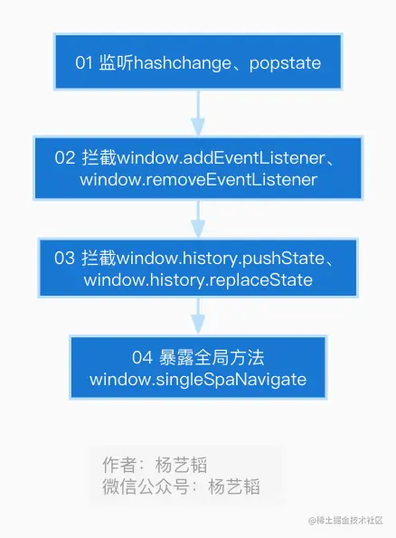
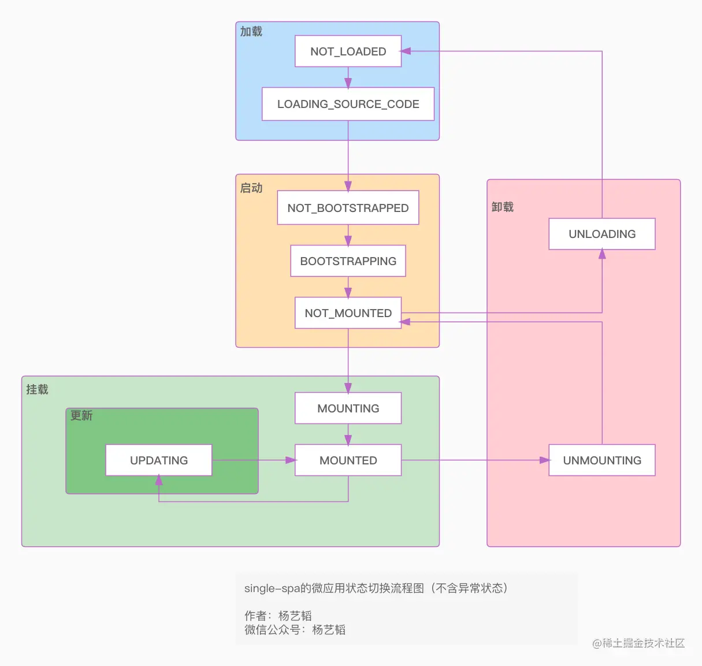

# 07.对single-spa的路由管理及微应用状态管理的分析

```ts
/******************************************************************/
/*****************     欢迎关注微信公众号：杨艺韬     *****************/
/******************************************************************/
```

>抛开**手动**对微应用进行加载、挂载等操作不讲，`single-spa`最主要的应用场景是根据路由的切换来自动对已注册的微应用进行一系列管理。这里面有两个重要环节，**一**是对路由的变化进行监听和控制，**二**是根据路由的变化改变微应用的一些状态。本文就分两大部分，从源码层面分别对`single-spa`的路由管理和微应用状态管理进行分析。

# 路由管理机制
## 路由管理的初始化的主要逻辑
请先浏览流程图：



从流程图中，关于路由管理的初始化，`single-spa`做了**4**件事情。我们同时看看代码：
```javascript
// 代码片段1
if (isInBrowser) {
  // 对应流程图第1步
  window.addEventListener("hashchange", urlReroute);
  window.addEventListener("popstate", urlReroute);
  // 对应流程图第2步
  // 这里省略许多代码...
  window.addEventListener = function (eventName, fn) {
    if (typeof fn === "function") {
      // 这里省略许多代码...
      // 如果eventName为hashchange或popstate，则将fn存入一个数组变量中，并直接return
    }
    return originalAddEventListener.apply(this, arguments);
  };

  window.removeEventListener = function (eventName, listenerFn) {
    if (typeof listenerFn === "function") {
      // 这里省略许多代码...
      // 如果eventName为hashchange或popstate，则将listenerFn从数组变量中移除，并直接return
    }
    return originalRemoveEventListener.apply(this, arguments);
  };
  // 对应流程图第3步
  window.history.pushState = patchedUpdateState(
    window.history.pushState,
    "pushState"
  );
  window.history.replaceState = patchedUpdateState(
    window.history.replaceState,
    "replaceState"
  );
  // 省去许多代码...
  // 对应流程图第4步
  window.singleSpaNavigate = navigateToUrl;
}
```
结合流程图和代码，每一步都可能能够理解，但是源码为什么会这么写呢？我们可以这样来描述上述**4**个步骤。**首先**，监听`hashchange、popstate`事件本身；**其次**，拦截设置`hashchange、popstate`监听事件的监听函数；**再次**，拦截可能改变路由状态的**api**方法；**最后**，提供一个全局的工具函数，方便用户改变路由状态。这里有两个方面值得我们注意，**一**是要明白，调用`history.pushState`或`history.replaceState`并不会触发`popstate`事件。**二**是在世纪编码中如果要试图去劫持某个行为，不仅要劫持相应的监听事件，还要劫持可能改变该行为又不会触发监听事件的相应`API`。另外，需要注意的是，代码片段**1**中的代码是在文件`src/navigation/navigation-events.js`中的最外层，并未放到函数中并调用，虽然`single-spa`是个优秀的开源库，但个人仍然认为这样代码结构不值得学习在实际编码中应该予以规避。下面是`MDN`关于`history API`的相关文档原文说明。
>Note that just calling history.pushState() or history.replaceState() won't trigger a popstate event. The popstate event will be triggered by doing a browser action such as a click on the back or forward button (or calling history.back() or history.forward() in JavaScript).

从上面代码代码片段**1**对应的流程图第**1**步中的代码，我们知道`single-spa`为`popstate、hashchange`两个事件注册了监听事件，事件触发后会执行`urlReroute`函数。而`urlReroute`函数内部只是调用了`reroute([], arguments)`这样一行代码。关于这个`reroute`函数非常重要，几乎所有（之所以不是全部，是因为`single-spa`还有些跟路由无关的机制）微应用的状态变化和管理都根这个函数有着紧密的联系，后续文章中会有所介绍。现在我们继续先看路由管理的初始化相关的内容。

## 劫持监听事件
我们先看一下，劫持`hashchange、popstate`事件的具体实现：
```javascript
// 代码片段2
const originalAddEventListener = window.addEventListener;
const originalRemoveEventListener = window.removeEventListener;
window.addEventListener = function (eventName, fn) {
    if (typeof fn === "function") {
      if (
        routingEventsListeningTo.indexOf(eventName) >= 0 &&
        !find(capturedEventListeners[eventName], (listener) => listener === fn)
      ) {
        capturedEventListeners[eventName].push(fn);
        return;
      }
    }
    return originalAddEventListener.apply(this, arguments);
};
window.removeEventListener = function (eventName, listenerFn) {
    // 内部实现和window.addEventListener类似，不在此赘述
};
```
代码片段**2**中，核心逻辑我们可以这样概括，将原始的`window.addEventListener`和`window.removeEventListner`保存起来，然后对这两个监听函数进行重写。重写的内容其实也很简单，如果将要监听的事件是`hashchange`或`popstate`，则将相应的回调函数保存在一个数组中，待合适的时机进行批量执行，同时监听函数返回。如果所要监听的函数不是`hashchange`或`popstate`，则调用原始的`window.addEventListener`或`window.removeEventListner`注册对应的监听事件。这种改变原函数行为的机制有人称之为`Monkeypatch`，例如本文中有下面的注释：
```javascript
// Monkeypatch addEventListener so that we can ensure correct timing
```
在实际编码中，如果有相似场景，可以借鉴这种写法。
## 劫持history API
```javascript
// 代码片段3
window.history.pushState = patchedUpdateState(
    window.history.pushState,
    "pushState"
);
window.history.replaceState = patchedUpdateState(
    window.history.replaceState,
    "replaceState"
);
```
代码片段**3**中是拦截`window.history.pushState`和`window.history.replaceState`两个`API`。
### patchedUpdateState
具体处理函数是`patchedUpdateState`,代码如下：
```javascript
// 代码片段4
function patchedUpdateState(updateState, methodName) {
  return function () {
    const urlBefore = window.location.href;
    const result = updateState.apply(this, arguments);
    const urlAfter = window.location.href;

    if (!urlRerouteOnly || urlBefore !== urlAfter) {
      if (isStarted()) {
        window.dispatchEvent(
          createPopStateEvent(window.history.state, methodName)
        );
      } else {
        reroute([]);
      }
    }

    return result;
  };
}
```
内部逻辑也比较简单，主要做了三件事情，**一**是调用未被重写过的`window.history.pushState`或`window.history.replaceState`，然后将执行结果记录为`result`。**二**是记录调用`API`前后`window.location.href`的值。**三**是触发一个自定义的事件，具体是什么样子的事件，由函数`createPopStateEvent`生成。
### createPopStateEvent
```javascript
// 代码片段5
function createPopStateEvent(state, originalMethodName) {
  let evt;
  try {
    evt = new PopStateEvent("popstate", { state });
  } catch (err) {
    evt = document.createEvent("PopStateEvent");
    evt.initPopStateEvent("popstate", false, false, state);
  }
  evt.singleSpa = true;
  evt.singleSpaTrigger = originalMethodName;
  return evt;
}
```
代码片段**5**中主要做了三件事，**一**初始化一个事件对象，**二**是对该事件对象添加一些标识性质的属性，**三**是做一些兼容性处理。至于为什么要这样进行兼容性处理，请阅读源码中指示的相关`issues`地址。
## window.singleSpaNavigate
对应上文流程图中的第**4**步，有下面这行代码。
```javascript
window.singleSpaNavigate = navigateToUrl;
```
该函数主要的功能是如源码中的注释所示：
>For convenience in `onclick` attributes, we expose a global function for navigating to whatever an \<a> tag's href is.

我们来看看`navigateToUrl`是如何进行处理的：
```javascript
export function navigateToUrl(obj) {
  let url;
  if (typeof obj === "string") {
    url = obj;
  } else if (this && this.href) {
    url = this.href;
  } else if (
    obj &&
    obj.currentTarget &&
    obj.currentTarget.href &&
    obj.preventDefault
  ) {
    url = obj.currentTarget.href;
    obj.preventDefault();
  } else {
    // 省略一些代码... 此处在抛出错误
  }

  const current = parseUri(window.location.href);
  const destination = parseUri(url);

  if (url.indexOf("#") === 0) {
    window.location.hash = destination.hash;
  } else if (current.host !== destination.host && destination.host) {
    // 省略一些代码... 一些条件判断
    window.location.href = url;
  } else if (
    destination.pathname === current.pathname &&
    destination.search === current.search
  ) {
    window.location.hash = destination.hash;
  } else {
    // different path, host, or query params
    window.history.pushState(null, null, url);
  }
}
```
上面的逻辑其实比较简单，就不逐行代码解释了。相反，我这里要把`single-spa`的使用文档中的内容放到这里，相信有助于理解上面源码为什么要这么写。说到底这只是一个工具方法，没有它也不影响程序本身，所以重要性一般，也就不在此对文档进行逐行翻译了。
```javascript
/*Use this utility function to easily perform url navigation between registered applications without needing to deal with event.preventDefault(), pushState, triggerAppChange(), etc.

arguments
    navigationObj: string | context | DOMEvent
    navigationObj must be one of the following types:
    a url string.
    a context / thisArg that has an href property; useful for calling singleSpaNavigate.call(anchorElement) with a reference to the anchor element or other context.
    a DOMEvent object for a click event on a DOMElement that has an href attribute; ideal for the <a onclick="singleSpaNavigate"></a> use case.*/

// Three ways of using navigateToUrl
singleSpa.navigateToUrl('/new-url');
singleSpa.navigateToUrl(document.querySelector('a'));
document.querySelector('a').addEventListener(singleSpa.navigateToUrl);

<!-- A fourth way to use navigateToUrl, this one inside of your HTML -->
<a href="/new-url" onclick="singleSpaNavigate(event)">My link</a>
```
到这里，我们对`single-spa`的路由管理已经有比较深入的理解，下文就进入`single-spa`的另一个重要主题**微应用的状态管理**吧。
# 微应用的状态管理机制
关于这部分内容，会分两个方面进行讲解：
- 微应用的**状态种类及状态间的转化关系**
- 微应用的**状态切换流程**

先知道微应用有哪些状态，后看源码中是如何具体实现这些状态变化。
## 微应用的状态种类
我们先看`src/applications/app.helpers.js`文件中关于微应用状态的常量声明：
```javascript
// App statuses
export const NOT_LOADED = "NOT_LOADED";
export const LOADING_SOURCE_CODE = "LOADING_SOURCE_CODE";
export const NOT_BOOTSTRAPPED = "NOT_BOOTSTRAPPED";
export const BOOTSTRAPPING = "BOOTSTRAPPING";
export const NOT_MOUNTED = "NOT_MOUNTED";
export const MOUNTING = "MOUNTING";
export const MOUNTED = "MOUNTED";
export const UPDATING = "UPDATING";
export const UNMOUNTING = "UNMOUNTING";
export const UNLOADING = "UNLOADING";
export const LOAD_ERROR = "LOAD_ERROR";
export const SKIP_BECAUSE_BROKEN = "SKIP_BECAUSE_BROKEN";
```
从代码中可以直观的看出一共有**12**种状态。为了更容易把握`single-spa`的核心功能，本文会省略对下面两个状态的讲解，也就是本文会涉及到其他**10**种状态的描述。
```javascript
export const LOAD_ERROR = "LOAD_ERROR";
export const SKIP_BECAUSE_BROKEN = "SKIP_BECAUSE_BROKEN";
```
## 微应用的状态切换流程
我们先看看流程图：


从图中可以直观的看出，虽然状态很多，抛开异常状态，微应用状态数量多达**10**个，但是可以概括为**4**个大的状态：**加载**、**启动**、**挂载**、**卸载**。我们可以把**更新**涉及到的状态理解为`MOUNTED`状态下的一种特殊状态。说到这这时候是不是有些似曾相识。还记得我们在注册微应用的时候有个加载微应用的函数作为注册函数`registerApplication`的参数``applicationOrLoadingFn: () => <Function | Promise>``传入。而执行完这个加载函数会返回一个对象，该对象上有三个函数：`bootstrap`、`mount`、`unmount`。没错，流程图中对应的四个大的状态就对应着上面四个函数。下文，我们以**加载**阶段为例，来看`single-spa`如何对微应用的状态进行控制。至于其他的状态变化和**加载**阶段状态的变化并没有太大的不同，就不在本文中进行赘述了。
还记得我们前面的文章中提到的，在注册微应用的时候有这样一行代码吗：
```javascript
apps.push(
    assign(
      {
        loadErrorTime: null,
        status: NOT_LOADED,
        parcels: {},
        devtools: {
          overlays: {
            options: {},
            selectors: [],
          },
        },
      },
      registration
    )
  );
```
没错，也就是说我们注册的微应用，初始状态就是`NOT_LOADED`。在**加载**阶段，会涉及一个`toLoadPromise`函数，代码如下：
>注：至于`toLoadPromise`是在何时调用，本文暂不分析，在后面会有文章介绍`reroute`函数的一些主要逻辑的时候会提到，此时只需要该函数会在**加载**阶段执行即可。
```javascript
export function toLoadPromise(app) {
  return Promise.resolve().then(() => {
    // 此处省略许多代码...
    app.status = LOADING_SOURCE_CODE;
    // 此处省略许多代码...
    return (app.loadPromise = Promise.resolve()
      .then(() => {
        // 此处省略许多代码...
        return loadPromise.then((val) => {
          // 此处省略许多代码...
          app.status = NOT_BOOTSTRAPPED;
          // 此处省略许多代码...
          return app;
        });
      })
      .catch((err) => {
        // 此处省略许多代码
        if (isUserErr) {
          // 这就是本文没涉及到的错误相关的状态
          newStatus = SKIP_BECAUSE_BROKEN;
        } else {
          // 这就是本文没涉及到的错误相关的状态
          newStatus = LOAD_ERROR;
          // 此处省略许多代码
        }
        // 此处省略许多代码
        return app;
      }));
  });
```
从上面的代码中不难看出，所谓的状态变化，就是在不同阶段修改代表微应用的对象`app`上面的`status`属性的值。

欢迎关注我的 `微信公众号：杨艺韬`，可以获得最新动态。