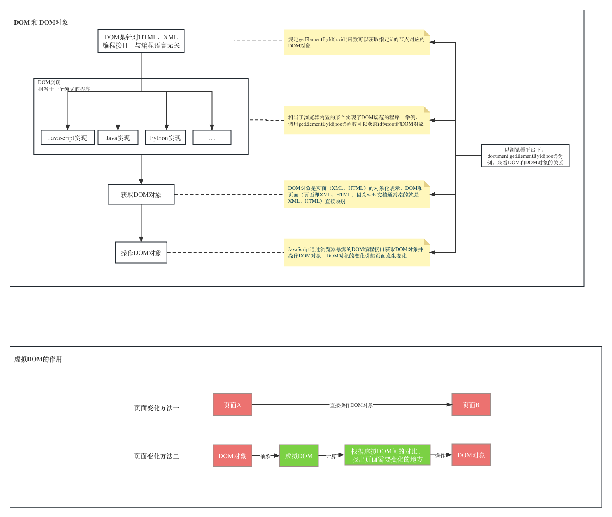
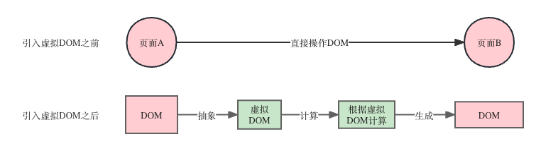

# 03.虚拟DOM与真实DOM的实况对比
在编写代码前我们先了解两个概念：**虚拟DOM**和**JSX**，本小节介绍虚拟DOM，下一小节介绍JSX。

那什么是**虚拟DOM**呢？我们从字面上可以看出虚拟DOM和DOM是息息相关的。因此要理解虚拟DOM，还得先搞清楚**DOM**是什么才行。所以我们本小节先探索**DOM**是什么，再探索**虚拟DOM**是什么。

## 概念：DOM
我们从两个方面来探索：
- DOM是什么
- DOM有什么用

### DOM是什么
什么是DOM呢？在MDN官方文档，关于什么是DOM有这样的解释：
> The Document Object Model (DOM) is a programming interface for web documents.  [原文链接](https://developer.mozilla.org/en-US/docs/Web/API/Document_Object_Model/Introduction)

这几句话直接翻译过来是：
DOM（Document Object Model）是编程接口，是什么的编程接口呢？是Web文档的编程接口。那什么是Web文档呢？一般来说Web文档是指XML或HTML文档，也就是说**DOM是XML和HTML文档的编程接口**。

### DOM的作用
我们刚才了解到的DOM编程接口，有什么用呢？同样是MDN官方文档，有这样的描述：
> It represents the page so that programs can change the document structure, style, and content. The DOM represents the document as nodes and objects; that way, programming languages can interact with the page.  [原文链接](https://developer.mozilla.org/en-US/docs/Web/API/Document_Object_Model/Introduction)

通过DOM来表示页面，能够方便程序对文档结构、样式、内容的改变。DOM以节点和对象的方式来表示文档，这样，程序语言就能够和页面进行交互。

看了官方文档感觉还是很抽象，我们在这里换个方式表达：

### DOM具备两层含义
- 1.DOM是一种编程规范
- 2.DOM是对文档（HTML、XML）的对象化描述

接下来我们通过一个例子来对这两层含义进行一起解释：


举一个例子，下面这样一个html元素：
```html
<div id="root" style="color: red;"><div>Hello Simple React</div></div>
```
我们在浏览器的控制台下获取这个DOM节点：
```js
document.getElementById('root')
```
会发现直接将对应的html标签打印出来了，这是由于浏览器做了处理，直接将DOM对象转化成了html标签，因此我们将代码做一些调整：
```js
let element = document.getElementById('root');
let obj = {}
for(let key in element){
   obj[key] = element[key]
}
console.log(obj)
```
会发现是一个由很多key value值组成的对象。这其实就是我们的DOM对象。

上面几个步骤，我们可以这样描述：通过`document.getElementById('root')`这样一个函数调用，得到了id为root的html节点的对象表示。而函数`getElementById('root')`并不是Javascript语言的提供的能力，只是调用了浏览器平台下暴露的接口，可以理解为我们调用了一个独立的程序，而这个独立的程序实现了DOM规范，当调用函数`getElementById('root')`时候，该独立程序返回了id为root的html节点的对象表示。至于我们调用的这个独立的程序，不管是用Javascript还是用Java、C++、Python等等都是可以的，
因此DOM只是一种编程规范，而这种规范是和具体编程语言无关的，可以通过很多语言来实现。只不过在浏览器环境下，我们可以通过JavaScript来调用这个独立的程序。

对于刚才介绍的内容，我们可以结合这张示意图进行理解：


刚才我们在控制台执行这样的代码：
```js
let element = document.getElementById('root');
let obj = {}
for(let key in element){
   obj[key] = element[key]
}
console.log(obj)
```
直观的感受到了，dom对象是一个成本很高的，属性数量非常之多。对前端程序而言, 当对大量dom进行操作的时候（当然这里的操作是指，对DOM属性、节点的增删改查），性能会成为一个压力。

关于DOM我们暂时就了解这么多，接下来我们来探索虚拟DOM。

## 概念：虚拟DOM
由于操作DOM对象的成本很高，因此引入了虚拟DOM，那虚拟DOM究竟是什么呢？简单的讲，虚拟DOM就是用于描述DOM对象的对象，与DOM对象不同的是，虚拟DOM只包括程序中所需要的属性，以刚才我们看到的DOM属性为例，一般来说其中绝大部份属性，在JavaScript程序中都是非必须的。以React为例，我们打印一个react元素，其对DOM进行描述的**虚拟DOM**大概有如下字段：
```js
  const element = {
    $$typeof: REACT_ELEMENT_TYPE,
    type,
    key,
    ref,
    props,
    _owner: owner,
  };
```
我们暂时不用关心这每个字段的含义，比如一个div标签`<div></div>`，其标签类型`div`可以用type表示，props会包含该标签的style、class等属性，至于key和ref是React需要用到的特殊字段，这里暂时不介绍，总之这简单的几个字段已经包括了程序执行所必须的信息，单从字段数量来看，和**DOM**相比，可以说就已经差别相当大了。


虚拟DOM是如何发挥作用呢？如果是一个普通的HTML静态页面，页面是不会发生任何变化，虚拟DOM则没有任何存在的必要，但是随着Web页面有了越来越复杂的交互性，我们的页面往往会随着时间或者事件的触发动态发生变化，这就意味着需要频繁的对DOM进行操作，就像我们这张图所示：


如果没有引入虚拟DOM，那就只能通过直接操作DOM来进行页面的变化，而页面A到页面B，到底有多少变化，需要我们遍历DOM树，进行对比，才能知道如何变化,如果不这样对比就只能重新渲染整个页面，用户体验会非常糟糕。然而操作DOM对象的成本是很高的，很多的DOM对象，只是遍历属性就是很重的负担，这时候虚拟DOM就派上了用场。

就如图片所展示的，虚拟DOM是DOM对象的进一步抽象，代表了该DOM对象的关键信息，成本很低，利用低成本的虚拟DOM来计算需要更新哪些DOM对象，最后再根据计算的结果来操作真实的DOM对象。虚拟DOM的引入，大幅度的降低了计算成本。这里提到的对虚拟DOM进行计算操作，至于怎么对虚拟DOM进行计算怎么操作这时候充满疑惑也不要紧，我们在编写React源码的时候，会有直观的感受。
