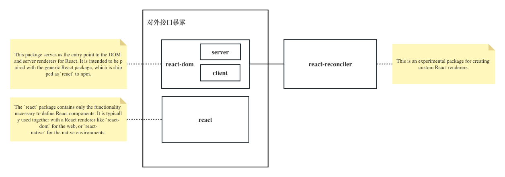

# 05.React和ReactDOM职责划分
同学们好，上一小节我们对JSX已经有了初步的了解，已经准备好了编写React原始版代码的相关理论知识，但是刚要着手编写实际代码的时候，突然发现我们面临着一个问题：我们的代码应该怎么暴露给开发者使用？

结合这张图片，我们来观察React18原版源码中最关键的三个包：

最关键的三个包是react、react-dom、reconciler，这三个包有什么样的职责划分呢？
- **react**包，专注于组件相关核心API的暴露，这部分内容是跨平台的，不管是服务端渲染，客户端渲染，甚至是react-native，就组件本身的api而言都是一致的
- **react-dom**包，与react包配套使用，专注于将编写好的组件渲染到某个平台中去，比如web端，或者服务端。也就是解决了将组件渲染到哪里去的问题，这个观点可以从官方文档[ReactDOM api](https://reactjs.org/docs/react-dom.html)中暴露的api中得到印证
- **react-reconciler**包，渲染相关的基础公用逻辑，这部分也可以理解是跨平台的。正如react-reconciler这个包中README.md提到了：这个包用于创建自定义的React渲染器。我们可以认为react-dom就是利用这个react-reconciler包创建了一个符合自己特定场景的渲染器。

当然上面的分析是针对我们React18原版源码。我们当前在编写原始版本的代码的时候，不会按照这样的方式进行包的拆分，因为我们的逻辑会很精简，只需要很少的文件就可以实现所有的逻辑。在本课程的后半部份，实现Fiber架构下的React源码的时候，会完全遵循这些代码的组织方式，包的拆分，函数名称，文件名称都会尽可能和原版源码保持一致，。

关于react18源码基本情况的更多内容，可以参阅[官方文档](https://reactjs.org/docs/codebase-overview.html)
