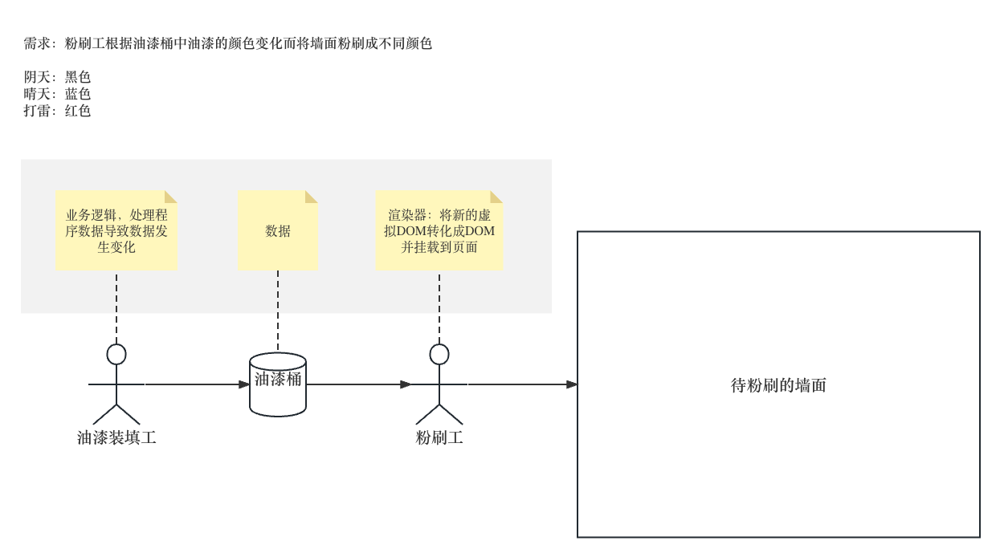

# 05.类组件的更新机制
前面我们已经能够利用类组件实现简单的渲染，比如能支持这样的代码运行：
```js
import React from './react';
import ReactDOM from './react-dom';
class MyClassComponent extends React.Component{
    render(){
        return <div className='test-class' style={{color: 'red'}}>
                    Simple React App {this.props.xx}
               </div>
    }
}
ReactDOM.render(<MyClassComponent xx="xx1"/>, document.getElementById('root'))
```
这个代码片段执行的结果只能是一个静态页面不会有任何变化，因为我们目前所实现的组件功能都还只是执行后返回了一个Element（也就是虚拟DOM），本质上和我们直接编写一个Element渲染到页面没什么区别，就像是这样的代码：
```js
ReactDOM.render(<div></div>, document.getElementById('root'))
```
那我们怎么才能发挥组件的作用，我们前面也讲过，组件相对于Element一个很大的特点，就是组件是一个动态的系统，可以根据不同的条件和逻辑返回不同的Element。这里所说的根据不同的条件和逻辑，更多的是指根据不同的数据返回不同的Element。那既然是是根据不同的数据返回不同的Elment，就要求我们在数据发生变化的时候，重新返回不同的Element并渲染到页面上。那这个随着数据变化，渲染不同内容到页面的过程，我们就称之为更新。为了加深大家的理解，一起来看这样一个比喻：


假如有这样一个场景：
油漆工将墙面粉刷成油漆桶中油漆的颜色，但是要求只要油漆桶中油漆的颜色发生变化，那么油漆工就需要立即将墙面的重新粉刷成新的颜色。而这里有一位油漆装填工，专门负责根据不同的情况为油漆桶放入不同的颜色，比如根据天气不同放入不同颜色的油漆。

这里存在一个问题，怎么能立即让油漆粉刷工知道油漆桶中的油漆的颜色发生了变化。我们可以想到两个比较容易理解的方案：
1. 给油漆桶添加个颜色感应器，颜色变化了就报警
2. 油漆装填工换了油漆后通知油漆粉刷工

> 其实这两种方案，对应到前端框架，一个是监听数据的方式来触发更新（比如Vue），一个是手动通知的方式触发更新（比如React）。这两种方式各有优点，其实，如果能找到别的更好的方式来进行触发更新，我们甚至可以打造一款新的更先进的前端框架。这其实给我们一些喜欢造轮子的同学给了一个启示，也就是如果造一个比市面上已有框架更好的开源程序，其核心点就是能在其核心功能的实现上进行方案的改变，进而对其大幅度的优化。

当然，我们这们课程的主题是探索React的实现，因此我们采用了手动通知的方式更新数据，在这个背景下，我们如果把：
1. 油漆粉刷工，比作前端框架中的渲染器，其实就是我们前面已经实现过的，根据不同数据生成虚拟DOM，根据虚拟DOM生成真实DOM并挂载到页面上。
2. 油漆桶中的油漆，可以比作数据
3. 墙面，比作浏览器的页面
4. 油漆装填工，比作改变数据的函数，比如回掉函数，setTimeout、setInterval定时任务

在React的世界里，而手动通知进行更新在类组件中最常见的方式就是我们的setState方法，在函数组件中的更新方式呢我们在Hooks相关内容的章节再进行介绍。好了本小节关于类组件的更新机制就暂时分析到这里，下一小节我们就会手动实现setState方法，谢谢大家。