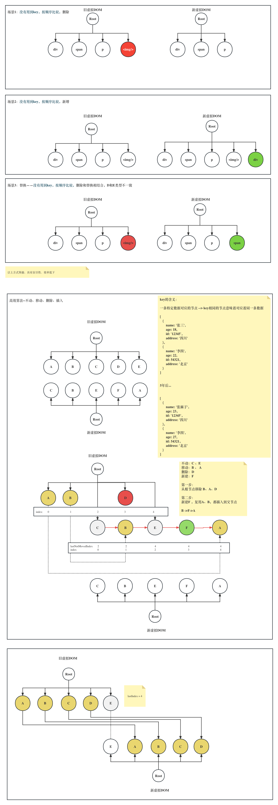

# 02.React DOM DIFF算法原理
在分析React DOM DIFF算法具体实现之前，我们先分析一下DOM DIFF究竟是什么。

在前面讲解初始化渲染的时候，我们就已经知道，在React中，渲染一个页面大致可以分为三个阶段：
1. 生成虚拟DOM
2. 将虚拟DOM转化为真实DOM
3. 将真实DOM挂载到页面上

而现在，我们要对已经渲染的页面进行重新渲染，本质上也一样是这样三个大的阶段，毕竟从根本上讲就是一次渲染过程，但是出于对性能的考量，在这三个阶段的基础上做了优化。我们来分别针对这三步看有什么优化空间:
1. 生成虚拟DOM（很难优化，数据变了必然导致虚拟DOM发生变化）
2. 将虚拟DOM转化为真实DOM（可以优化点：找到与旧虚拟DOM不同的虚拟DOM，只让真实DOM进行必要的操作）
3. 将真实DOM整体挂载到页面上

> 视频中会对下图进行解释

我们可以这样总结，React DOM DIFF 算法的本质就是，找出发生变化的虚拟DOM，然后根据新旧虚拟DOM的差异，对页面的DOM树进行新增、删除节点或者进行节点编辑等操作。

好了关于React DOM DIFF的原理，我们就先介绍到这里，谢谢大家。