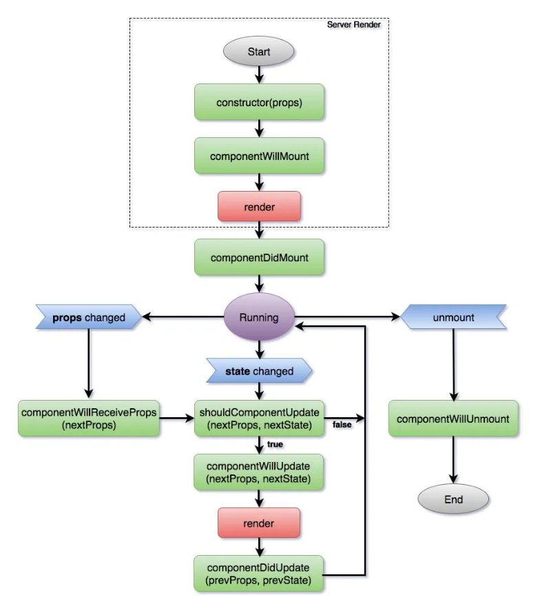

# 05.生命周期图观察
React已经历经多年发展，其生命周期函数已经发生了不少变化。我们先来观察一张老的生命周期图：

从图片上可以看出这些生命周期函数都有比较清晰的阶段划分，即初始化，更新，卸载三个阶段，这三个阶段的划分是从时间维度进行划分的。

我们来观察[新的生命周期函数](https://projects.wojtekmaj.pl/react-lifecycle-methods-diagram/)

从链接指向的图片可以发现，在现在的生命周期函数中，有横向和纵向两个维度的阶段划分，从时间维度依然有初始化、更新、卸载三个阶段。但是由于React引入了Fiber架构，站在其工作方式的角度也可以划分为三个阶段，即：
- `Render phase`
- `Pre-commit phase`
- `Commit phase`

鉴于这三个阶段的划分与Fiber架构息息相关的，这方面的内容我们在课程的后半部分手写React18源码的时候再进行介绍，这里我们忽略即可。

我们从这张图的上面可以观察到显示或隐藏不常用的生命周期函数，也可以从两个版本中选择一个。
粗体字标记的是常用的生命周期函数，包括：
- `constructor`
- `render`
- `componentDidMount`
- `componentDidUpdate`
- `componentWillUnmount`

我们在之前的课程中已经不知不觉实现了两个生命周期函数。刚才看了常用的生命周期函数，现在再来看看不常用的生命周期函数，包括三个函数：
- `static getDerivedStateFromProps`
- `shouldComponentUpdate`
- `getSnapshotBeforeUpdate`

其中我们切换图片上方的版本的时候，其区别仅仅是`getDerivedStateFromProps`的作用范围不一样。我们编写的是图片上展示的`>=16.4`版本的相关函数。
> 注：这里图片展示的不管是`>=16.4`还是`16.3`都属于新版本的生命周期函数。

我们回过头来看一看老版本的生命周期图片，会发现有三个生命周期函数名称为：
- `componentWillMount`
- `componentWillReceiveProps`
- `componentWillUpdate`

这三个函数在新版本的生命周期函数中是不存在的。
而新版本的两个生命周期函数`getDerivedStateFromProps`和`getSnapshotBeforeUpdate`在老版本中也是不存在的。

这是因为老版本的三个周期函数容易理解错误从而误用导致问题，特别是在React引入Fiber架构的异步渲染后，更容易导致bug产生。我就不在这里继续展开介绍这些旧的生命周期函数的具体功能有什么样的缺陷，因为我们也不会实现这些已经不推荐使用的生命周期函数，如果有同学感兴趣，可以阅读官方的一篇博客文章，里面描述了为什么不推荐这三个生命周期函数，以及用例子来验证使用这些函数可能产生什么问题，请[点击链接](https://reactjs.org/blog/2018/03/27/update-on-async-rendering.html)观看。