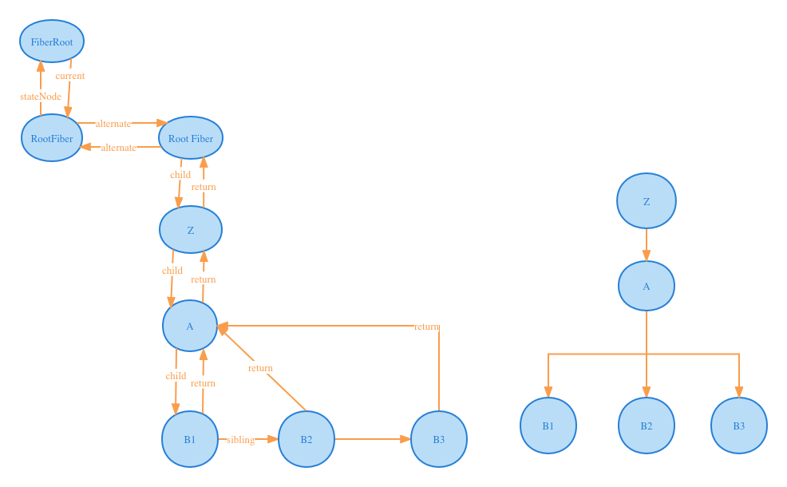

# Fiber是什么？
Fiber代表的是一种数据结构，在代码中体现为一个对象，这个对象包括很多属性，其中特别值得注意的有：

- type：组件的类型，可以是函数组件、类组件或原生 DOM 元素。
- key：组件的唯一标识符，用于在组件树中区分兄弟节点。
- props：组件的属性。
- stateNode：对于类组件，这是组件实例。对于原生 DOM 元素，这是实际的 DOM 节点。
- return：指向父 Fiber 节点的指针。
- child：指向第一个子 Fiber 节点的指针。
- sibling：指向兄弟 Fiber 节点的指针。
- flags：描述 Fiber 节点需要执行的副作用类型（如插入、更新或删除）。
- alternate：指向当前 Fiber 节点的替代 Fiber 节点，这是双缓存技术的关键部分。

我们来看一张图：


假设我们有一个简单的 React 应用，如下所示：
```js
import React from 'react';
function App() {
  return (
    <div>
      <h1>Hello, World!</h1>
      <p>Welcome to React Fiber.</p>
    </div>
  );
}
export default App;
```
在这个简化的示例中，React 将为根组件 App 创建一个 Fiber 节点。Fiber 节点的数据结构可能如下所示：
```js
const fiberNode = {
  type: App, // 函数组件
  key: null, // 没有 key
  props: {}, // 没有传入任何属性
  stateNode: null, // 函数组件没有实例
  return: null, // 根 Fiber 节点没有父节点
  child: {/* 指向第一个子节点的指针 */},
  sibling: null, // 没有兄弟节点
  flags: /* ... */, // 描述需要执行的副作用类型
  alternate: null // 没有替代节点
};

```
当 React 遍历组件树时，它将为每个组件创建一个 Fiber 节点，这些节点通过 return、child 和 sibling 指针相互关联。当组件树中的组件发生更新时，React 会创建新的 Fiber 节点，这些节点与旧 Fiber 节点一起组成一颗完整的 Fiber 树。

我们在前面在实现原始版React的时候，渲染过程是将虚拟DOM->转化为真实DOM->将真实DOM挂载到页面上。那我们的Fiber架构下，在虚拟DOM和真实DOM之间不进行直接的转化，而是通过一个桥梁来进行关联，这个桥梁就是Fiber对象。