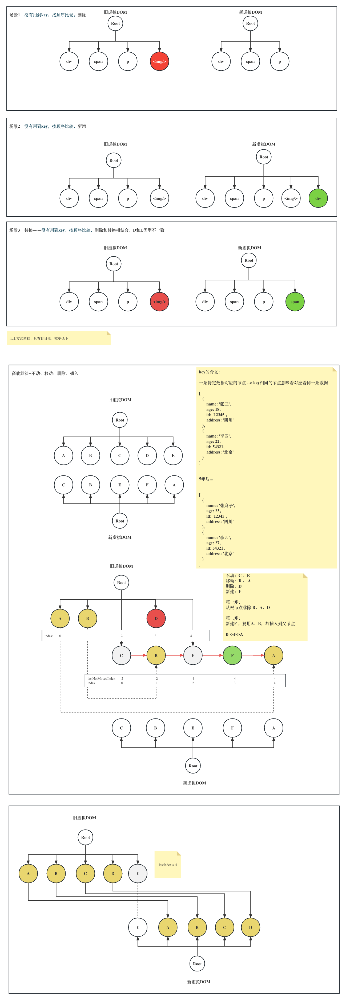
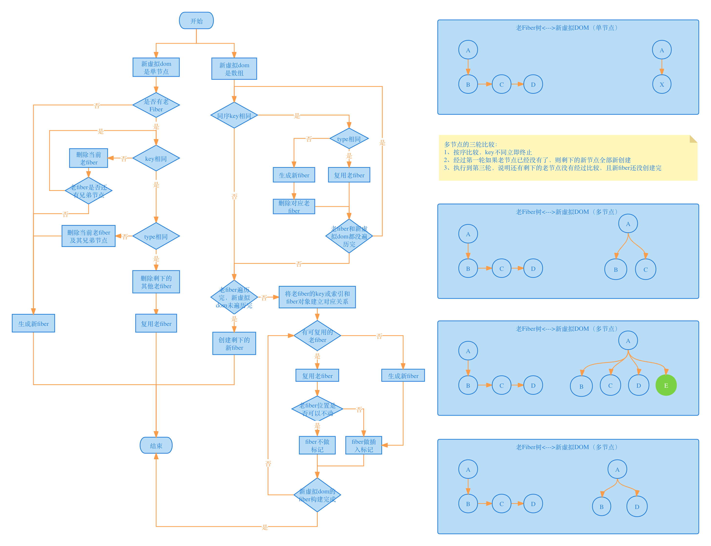
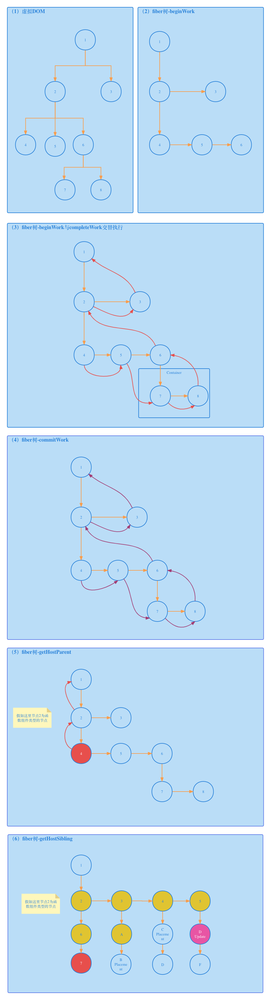
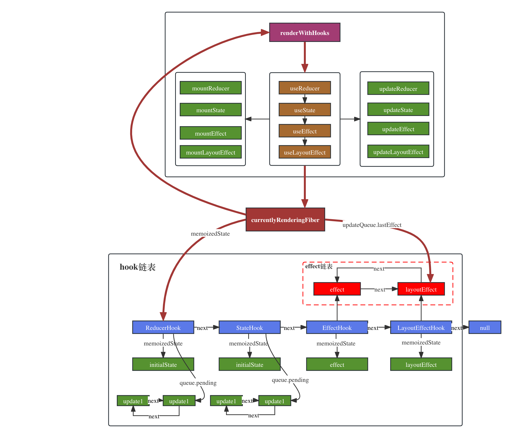

# 课程介绍
## 课程目标
- 在**宏观上**，掌握React18源码结构和**核心概念**
- 在**微观上**，掌握React18源码的**实现细节**

## 配套资料
视频：[React18内核探秘：手写React高质量源码迈向高阶开发](https://coding.imooc.com/class/650.html)

代码：[仓库地址，需先购买视频课程](https://git.imooc.com/coding-650)

文档：[官方文档](https://reactjs.org/)
> 视频中有些地方直接访问了官方文档的地址，但官方文档进行了更新，界面发生了不少变化，但并不影响我们的学习

本**电子书教程主要承载一些理论知识**，以及一些关键概念和参考资料，和视频小节一一对应，**视频主要承载代码的演化过程**。
## 知识范围
我们可以将本课程源码学习的知识范围总结为三大块内容：
- React核心原理
- React事件与状态管理
- React架构

### React核心原理
React核心原理相关知识，是指React不会轻易发生变化的内容，是其之所以存在的基础原理：
- 组件生命周期
- 虚拟DOM实现
- Diff算法
- 组件渲染与更新
- Hooks机制

> 这些内容除了Hooks，可以说是React一诞生到现在都存在的东西，甚至是Hooks也可以认为是函数组件的增强，从这个角度讲，也能说是一开始就存在的内容。

### React事件与状态管理
至于React事件与状态管理，可以理解为和用户的交互相关的内容，包括：
- 事件代理机制
- 自定义事件系统
- setState工作原理
- 状态更新处理
- props与state

### React架构
至于React架构，可以说是React18最重要的组成部分，我们前面说**React核心原理**部分的内容是不会轻易发生变化的，那React架构则是与时俱进的，对于React18来讲，React架构包括的主要知识点如下：

- Fiber系统
- Concurrent模式
- Lane模型
- 调度系统
- 时间切片

## 课程安排
课程总体上采取了自行向下的授课方法，体现在我们的课程分为上下两个部分，上半部分手写手写实现了一个最精简的贴合React最初形态的版本，这帮助我们树立了基本的React世界观。有了这个认知，我们再手写实现相对复杂的React18源码，理解起来更容易接受。

## 讲授方式
在具体的章节内容的讲解过程中，采取了理论实践相结合的讲课方法，先从原理上剖析再进入实现细节，由浅入深，遵循着应用实践->原理剖析->源码实现的讲述过程，即从实践中来，再到实践中去，比如先用一个应用案例来展示某一个功能的效果，然后剖析其底层原理，最后实现该部分源码。希望通过这样的授课方法，能够让大家更容易理解相对复杂的源码内容。

## 课程收获
- 对React的理解更加深刻，面试更具竞争力
- 快速定位工作中遇见的bug，提升工作效率
- 个人技术整体实力提升
- 掌握读源码的方法，具备写源码的能力

## 学习前提
学习这门课程需要具备一些前提条件，比如：
- 具备React事件经验
- 有原生JavaScript功底
- 热爱前端开发，有探究精神

## 课程优势
市面上有那么多源码剖析相关资料，为什么选择这门课，选择这门课程有什么样的优势呢？
- 课程有深度，从0到1手写实现与官方源码相近的代码，而不是简单的demo级代码，可以说最顶级的源码学习方式
- 注重总结源码背后的规律，授人以鱼，也授人以渔，比如在学习Fiber架构的时候，会分析性能在软件开发中的深刻意义（CPU、GPU资源的有限性），浏览器的渲染原理，不仅知道Fiber架构是什么，还要知道为什么有Fiber架构，又比如讲到任务优先级的时候，会从数据结构的角度进行分析，等等
- 本电子书作为教材，辅助视频学习
- 课程内容会随着React版本升级而更新，未来也会扩展更多内容

## 课程风采展示

### **老版本的DOMDIFF示意图**

### **React18Fiber架构下的DOMDIFF流程图**

### **Fiber树的演化**

### **Fiber架构下的Hooks示意图**

## 版权声明
作者: **杨艺韬**

授权: [署名—非商业性使用—禁止演绎 4.0 国际（CC BY-NC-ND 4.0)](https://creativecommons.org/licenses/by-nc-nd/4.0/)