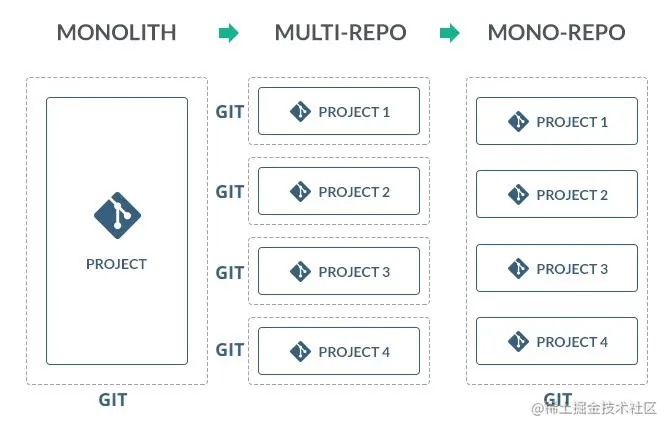

# 01.代码管理策略-monorepo
>`Vue3`采用了`monorepo`的方式来对项目代码进行管理。本文首先会介绍`monorepo`的一些基础知识，接着会介绍几种实现`monorepo`策略的具体方案，最后再进入`Vue3`的源码中了解其采取的具体方案和实施细节。


```ts
/******************************************************************/
/*****************     欢迎关注微信公众号：杨艺韬     *****************/
/******************************************************************/
```

# 基础知识
## monorepo是什么
我们先看看维基百科是怎么给`monorepo`定义的：
> In version control systems, a `monorepo` ("mono" meaning 'single' and "repo" being short for 'repository') `is a` software development `strategy` where code for many projects is stored in the same repository.

从定义中可以知道，`monorepo`是一种策略，该策略的具体内容是：**多个项目存储在同一个代码仓库中**。采用一种策略，肯定是因为该策略具备一些优点。当然，也要认清其缺点。从下面这张图中，我们可以看出，项目代码的组织策略是在实践中诞生，不断发展变化的。


在软件开发实践过程中，最初采用的代码组织策略很简单，不管有多少代码都放在一个项目中进行管理，这也就是单项目单仓库的策略，对应图中的`monolith`。随着时间的流逝，代码量多到一定程度的时候，会发现每一次构建都会花费很长时间，代码耦合度强可维护性差，代码冲突频繁等各种问题逐渐显现且愈加严重。于是聪明的工程师们，将业务相对独立的功能以不同的项目进行维护，对应图中的`multi repo`。这样确实解决了一些问题，比如项目自治，可维护性变强。但是也有一些新的问题出现，比如：
- 项目不同但相关联的功能联合调试困难，项目`A`想要调用项目`B`的能力，只能安装`B`发布的包进行依赖，所依赖的项目代码发生变化后也无法及时做出响应；
- 如果一个功能涉及到`A`和`B`两个项目，但因为项目在各自的仓库中维护，代码提交记录都无法完整反映出一个功能相关的所有代码；
- 效率低下，每个项目都需要独立配置相关项目环境，独立进行安装依赖、启动项目、版本发布等操作。

问题的出现，意味着问题的解决方案也快出现，`monorepo`就在工程师们感到头疼的时候诞生了。需要提示大家，`monorepo`作为一种代码管理策略，并不是新生事物，已经有20年以上的历史了，最初这种策略的名字叫`shared codebase`，只不过以`monorepo`这个称呼闻名于世。我们接下来就看看`monorepo`有什么优势和缺陷。
## monorepo有什么优势
### 优势1:重用代码更加容易
相似的功能可以抽取到一个单独的项目中进行维护，并且不需要借助依赖包管理器就可以在其所在仓库下的其他项目中进行引用。
### 优势2:简化依赖管理
在`multi repo`策略下，对于不同的项目，相同的三方依赖库可能需要各自进行下载、构建，重复工作。而在`monorepo`策略中，所有的依赖项都存放在同一个地方，这不仅方便管理，还可以进行很多优化。
### 优势3:提交记录原子化
由于是单个仓库对代码进行维护管理，那一次改动无论涉及几个项目，都能在当次提交记录中完整反映出来。比如一个功能需要改动两个项目，如果是两个仓库来维护这两个项目，那么追溯该功能所对应修改的代码，就显得很困难。
### 优势4:便于大规模代码重构
开发者可以访问仓库下的所有项目，对某个项目进行重构的时候，可以保证该项目重构后和其他项目组合在一起是可以正常运行的。反之如果开发者独立维护一个项目，对该项目重构后，是不是能在整个系统中正常运转很难去验证。
### 优势5:便于跨团队协作
比如团队`A`维护项目**一**，而团队`B`用到了项目**一**提供的能力，因为代码共享，可以及时跟踪项目**一**中的具体代码，甚至对该项目中的代码提供改进意见。
### 小结
上面列出了`monorepo`的几个优势，对于我们实际开发来讲，优势**1**、**2**、**3**，显得更加重要。至于优势**4**、**5**可能在其他团队会发挥比较大的作用，笔者的实践经历中没有明显的体会。同时，优势**3**、**4**、**5**都是单仓库天然的作用，没有太多内容可以讨论。而优势**1**和**2**在下文会有较多内容涉及到。
## monorepo有什么缺陷
### 丢失了版本信息
有些采用`monorepo`策略进行管理的代码，在构建的时候对仓库中所有的项目采用同一个版本号，这样导致每个项目自身丢失了符合语义的版本号。比如我在`vue3`中看仓库中的每个版本号也确实是一致的。
### 失去了对每个项目的访问权限控制
如果每个项目存放在单独的仓库，控制仓库权限就可以控制项目的访问权限。但在`monorepo`的策略下，多个项目的代码存放在同一个仓库中，难以对权限进行控制。当然，一般来说版本控制工具可以对权限进行细致的控制，这个缺陷可以规避。
### 默认需要更大的存储空间
这一点很好理解，在`monorepo`的策略下，默认会下载该仓库下的所有项目的代码。虽然这可以通过版本控制工具的能力来弥补这个权限，但是又会削弱`monorepo`原本具备的优势。
### 其他缺陷
比如代码规模大到一定程度，有海量频繁提交会触发`git`的能力瓶颈，导致无法正常工作。但鉴于普通企业普通项目，难以涉及这类特殊场景，本文就不做介绍了。
### 小结
古人说用人用的是其长处，我们采用`monorepo`更多的是因为其自身的优点，后文不会再讨论其缺陷。

# 管理monorepo类型项目的方案
上文解释过，`monorepo`是一种策略。理解这个概念很重要，因为刚接触`monorepo`的朋友容易把`monorepo`和某个具体的工具画上等号。比如存在下面的错误认识："monorepo就是yarn提供的workspace"、"monorepo就是yarn和lerna的组合"等等。`monorepo`是一个策略，是一种思想，而不是一个具体的工具。基于这个认识，我们就不难理解将一个策略落地，可以有多种方案。而本文将会由不断将方案进行增强演进，最终得出两个管理`monorepo`类型项目的优良方案。
## 方式1:手动管理
事实上实现`monorepo`策略，并不一定要借助额外的工具。那没有工具我们该具体怎么做呢？在行动之前我们要把握住`monorepo`一个核心要点，一个明显特征。核心要点是：**多个项目存放在同一个代码仓库中**。明显特征是：**项目可以引用其仓库下其他项目的代码**。
假设我们有三个拥有独立仓库的项目`A、B、C`，改造成以`monorepo`方式进行管理。改造后的项目结构如下：
```md
- root
    - package.json
    - projects
        - projectA
            - package.json
            - src
                - index.js
        - projectB
            - package.json
            - src
                - index.js
        - projectC
            - package.json
            - src
                - index.js
```
假设这三个项目的职责如下：
- projectA: 一个依赖库，供其他项目访问
- projectB: 一个`API`程序，启动后访问其监听的端口可以获取数据
- projectC: 一个`H5`页面，需要使用`projectA`提供的功能，需要访问`projectB`提供的`API`

在实际开发中，可能会逐一执行形如下面的命令行：
```shell
$ cd projects/projectA
$ npm install
$ npm build
```
```shell
$ cd projects/projectB
$ npm install
$ npm serve # 启动api服务项目
```
```shell
$ cd projects/projectC
$ npm install
$ npm start # 启动H5页面项目
```
另外在`projectB`的`package.json`可能会有下面的配置：
```json
{
 // 此处省略许多内容...
 "dependencies": {
    "vue": "^2.5.17",
    "@monorepo/A": "一个可以访问到projectA构建结果文件的相对路径"  // "@monorepo/A"是projectA中的package.json配置的name属性值
  }
}
// 此处省略许多内容...
```
一系列手动操作，完成了**3**项工作：
- 多个项目在同一个仓库下进行管理；
- 安装各个项目的依赖包，并启动各项目；
- 让`projectB`可以访问其所在仓库下的`projectA`的代码；

可以直观的感受到，要想让这个系统正常运行，需要我们重复的手动执行一系列命令。这种方式很落后，但不可否认，这确实是一个`monorepo`类型项目的管理方案。

## 方式2: lerna + npm
既然手动管理`monorepo`项目如上文描述的那般笨拙，那管理`monorepo`类型项目的工具也就诞生了，而`lerna`就是其中的佼佼者。`lerna`是什么呢？看官方文档是这样描述的：
>Lerna is a tool that optimizes the workflow around managing multi-package repositories with git and npm.

可以理解为这是一个为了`monorepo`而生的工具。我们可以看`lerna`的两个重要的命令：
- `lerna bootstrap` will link dependencies in the repo together. 
- `lerna publish` will help publish any updated packages.

可以看出`lerna pulish`命令是和版本发布相关的。`lerna bootstrap`主要完成了这么一项工作：进入所有的项目（如上文中`projectA、projectB、projectC`）目录，执行`npm install`命令安装依赖包。注意，在这里我们会发现，`lerna`会在每个子项目的根路径下面创建一个`node_modules`目录。

刚才讲了`lerna boostrap`这个命令的功能，下面简要介绍下如何配置`lerna`。
- 在根目录下新建一个`lerna.json`文件，按照惯例`lerna`默认使用的是`npm`。也就是说可以省略配置项`"npmClient": "npm"`。
- `lerna.json`中添加下面一个配置项，以便于`lerna`知道该去哪里寻找仓库中的项目：
```json
{
    packages:[
        "projects/*"
    ]
}
```
- 在根项目`package.json`中应该有下面的配置，然后执行`npm run bootstrap`：
```json
{
    scripts:{
        'bootstrap':'lerna bootstrap'
    }
}
```
>`lerna`为什么默认配置不是`"npmClient": "yarn"`呢？实际上`lerna`出现的时间甚至要早于`yarn`。

做了相应配置，执行相应的命令后，最终的结果和我们在**方式1**中的结果几乎是一模一样的。
## 方式3: lerna + yarn
方式**3**和方式**2**相比很相似。不同的是，在`lerna.json`文件中需要将`npmClient`的值变更为`yarn`。既然`lerna`和`npm`结合或者`yarn`结合实现的功能是如此的相似，那我们如何选择呢？可以问问自己下面两个问题：
- 自己是喜欢坚持行业标准呢还是喜欢Facebook提供的各种新特性？
- 是否真的关心安装依赖包的时间长短？
事实上，不管选哪一个差别都不会太大，按自己感觉来就行。

## 方式4: yarn workspaces
对于这种方式，我们不需要形如`lerna.json`的配置文件，因为`yarn workspaces`天然自带`monorepo`相关能力。虽然没有专用的配置文件，但需要在项目根路径下的`package.json`文件中做些配置，例如：
```json
{
    workspaces:[
        "projects/*"
    ]
}
```
这样`yarn`后续就知道在哪里去寻找`workspace`，这里的`workspace`其实就是各个子项目。当我们在项目根目录执行命令`yarn install`（这里的`install`可以省略）的时候，各个子项目也会安装各自的依赖项。这里和**方式1**与**方式2**有一个巨大的不同，执行完`yarn install`命令，只会在项目根路径下创建`node_modules`目录，各个子项目并没有这样一个目录来存放各自的依赖包。所有的依赖项都提升到了根路径下。事实上，**方式2**中如果执行`lerna boostrap`命令的时候加上`-hoist`标志，那么子项目的依赖项也会进行提升到根路径下。

## 方式5: lerna + yarn workspace
到了这里，大家可能会觉得奇怪，`yarn workspace`可以管理`monorepo`类型的项目，`lerna + npm/yarn`也可以管理`monorepo`类型的项目。为什么又将二者相结合起来呢？实际上，这里的`lerna`角色发生了变化，在**方式2**、**方式3**中，`lerna`需要执行`lerna boostrap`进入各个子项目安装相关依赖。而和`yarn workspaces`相结合的情况下，这些依赖管理的工作都交给了`yarn worksapces`。之所以使用`lerna`，是希望利用`lerna`提供的一些工具命令来优化对`monorepo`类型项目的管理，比如测试的时候，可以利用`lerna`选择性的执行某些命令。同时`lerna`还提供了诸如版本发布等可以优化开发体验的工具。具体怎么配置，有哪些命令，怎么使用这些命令，朋友们可以查阅相关文档，就不在本文赘述了。

## 方式6: pnpm workspace
`pnpm`作为一个比较新的工具，肯定是解决了旧工具中存在的一些问题。我们先看看`yarn`存在什么问题，`yarn`文档中有这样一段描述：
>Be careful when publishing packages in a workspace. If you are preparing your next release and you decided to use a new dependency but forgot to declare it in the package.json file, your tests might still pass locally if another package already downloaded that dependency into the workspace root. However, it will be broken for consumers that pull it from a registry, since the dependency list is now incomplete so they have no way to download the new dependency. Currently, there is no way to throw a warning in this scenario.

大意是说，在子项目（`yarn`称之为`workspace`）中当引用了一个三方依赖，如果没在该`workspace`下声明这个依赖，可能程序还能顺利执行，因为这个依赖库可能在别的`workspace`中安装过，由于`yarn`提升了所有`workspace`的依赖库到根路径下的`node_modules`进行管理，所以会出现这种情况，并且`yarn`也说了，这问题解决不了。

当然`yarn`还有其他问题，本文就不一一阐述。这里只需要知道，`pnpm`是一个相对新的，性能比较优良的包管理工具。

`pnpm`也有类似`yarn`的`workspace`机制。不过和`yarn`不同，`pnpm`也需要配置独有的配置文件。而在`Vue3`中，目前也采用的`pnpm`来进行包的管理。

# Vue3代码组织方式
先看看`Vue3`的包依赖关系：
```
                                    +---------------------+
                                    |                     |
                                    |  @vue/compiler-sfc  |
                                    |                     |
                                    +-----+--------+------+
                                          |        |
                                          v        v
                      +---------------------+    +----------------------+
                      |                     |    |                      |
        +------------>|  @vue/compiler-dom  +--->|  @vue/compiler-core  |
        |             |                     |    |                      |
   +----+----+        +---------------------+    +----------------------+
   |         |
   |   vue   |
   |         |
   +----+----+        +---------------------+    +----------------------+    +-------------------+
        |             |                     |    |                      |    |                   |
        +------------>|  @vue/runtime-dom   +--->|  @vue/runtime-core   +--->|  @vue/reactivity  |
                      |                     |    |                      |    |                   |
                      +---------------------+    +----------------------+    +-------------------+
```
与之匹配的，跟`pnpm`管理`monorepo`项目相关的代码如下：
```json
// 所在文件：core/pnpm-workspace.yaml ，注：vue3目前的仓库名叫core
packages:
  - 'packages/*'
```
```json
// 所在文件: core/package.json， 部分配置
{
    "devDependencies": {
        "@vue/reactivity": "workspace:*",
        "@vue/runtime-core": "workspace:*",
        "@vue/runtime-dom": "workspace:*",
        "vue": "workspace:*"
    }
}
```
这样带来的好处是，如`Vue3`文档描述的那样：
>The packages can import each other directly using their package names. Note that when importing a package, the name listed in its `package.json` should be used. Most of the time the `@vue/` prefix is needed: `import { h } from '@vue/runtime-core`.
>This is made possible via several configurations:
>- For TypeScript, `compilerOptions.paths` in `tsconfig.json`
>- For Jest, `moduleNameMapper` in `jest.config.js`
>- For plain Node.js, they are linked using [PNPM Workspaces](https://pnpm.io/workspaces).
# 小结
本文介绍了`monorepo`的基础概念。接着介绍了管理`monorepo`的几种方案，从原始的手动管理到`lerna + yarn` 、`pnpm`两种优良的管理方式。文末介绍了`Vue3`中关于`pnpm`管理`monorepo`类型项目的的相关配置。限于篇幅，文中并未从细节处系统性的去描述如何配置文件，如何执行命令，笔者后续会产出一系列的关于前端工具的文章，目前就先到这里。本文的目标是帮助大家理解`monorepo`的基本概念，知道日常开发中一些`monorepo`相关的工具的名称（`lerna、npm、yarn、yarn workspace、pnpm`）背后的含义和具备的能力，不会因为对`monorepo`认知的模糊而阻碍我们进入`Vue3`源码的世界，朋友们可以查阅文档了解这些工具的具体使用方式。下一篇文章，将会带着大家了解`Vue3`代码的构建流程。有了这些基础，我们才能在后续对`Vue3`源码进行顺利的调试，敬请朋友们期待。

参考资料：
- https://doppelmutzi.github.io/monorepo-lerna-yarn-workspaces/
- https://pnpm.io/workspaces
- https://yarnpkg.com/features/workspaces
- https://lerna.js.org/

## 写在最后
读完文章觉得有收获的朋友们，可以做下面几件事情支持一下：
- 如果您此刻在掘金看见这篇文章，辛苦`点赞`，增加掘力值，助我早日成为掘金优秀作者；
- 如果您此刻在微信公众号，请`点赞，点在看，转发`，让文章帮助到更多需要帮助的人；
- 如果是微信公众号的作者，可以找我开通`白名单`，`转载`我的原创文章；

最后，请朋友们关注我的`微信公众号: 杨艺韬`，可以获取我的最新动态。

