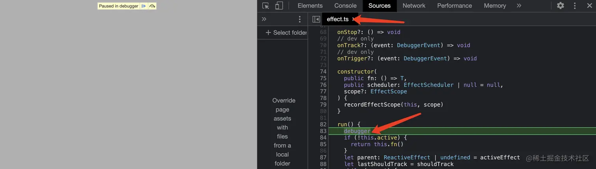
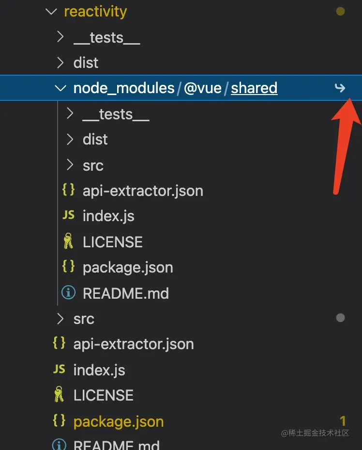

# 02.项目构建流程和源码调试方法
>作为一个现代前端框架，`Vue3`源码中包含了一系列的`js`脚本，支持对源码进行**构建**、**发布**，而**构建**又分为生产环境和开发环境两种不同场景的构建。本文主要分析`Vue3`源码的构建流程，对于**发布**暂时不讲解。在构建流程分析结束后，再讲解一个源码调试的案例，同时也会讲解为什么可以这样调试。为后续深入源码细节打下基础，同时也方便大家动手实践调试源码。


```ts
/******************************************************************/
/*****************     欢迎关注微信公众号：杨艺韬     *****************/
/******************************************************************/
```

# 概述
对项目的构建，本质上就是执行一段程序，让我们编写的代码，处理成一个符合实际场景需要的可执行的程序文件。当然对于`Vue3`的构建也不例外。在`Vue3`中，根据实际需要的不同，执行构建的命令是：`pnpm run build`或`pnpm run dev`。这里用`pnpm`还是`npm`没什么区别，为什么呢？因为执行`pnpm run dev`或`npm run dev`，本质上都是执行一个`js`程序，而这个`js`文件是一样的，从`package.json`可以找到对应的文件。我们看下面代码：
```json
// 所属文件：core/package.json 注：Vue3目前的工程目录名称是core
{
    // 这里省略许多其他内容...
    "scripts": {
        "dev": "node scripts/dev.js",
        "build": "node scripts/build.js"
        // 这里省略许多其他内容...
     }
     // 这里省略许多其他内容...
}
```
下文统一用`pnpm run dev`或`pnpm run build`两条执行命令来进行构建。
其实从名称已经可以看出，在开发阶段执行`pnpm run dev`，在正式准备发布的场景下执行`pnpm run build`进行构建。既然执行两个可执行文件来分别处理生产环境的构建和开发环境的构建，那二者肯定有所不同。先将主要的不同列在这里，大家在后文中可以看到这些差别的细节。
- 构建工具不同
- 构建目标不同
- 构建流程不同

另外，在`core/scripts`（注：Vue3目前的项目根目录名叫`core`而不是之前的`vue-next`）目录下有下面几个文件：
```md
-core
    - scripts
        - bootstrap.js
        - build.js
        - dev.js
        - filter-e2e.js
        - filter-unit.js
        - preinstall.js
        - release.js
        - setupJestEnv.js
        - utils.js
        - verifyCommit.js
```
这些文件`Vue3`中的一些脚本，我们当前只需要关心`build.js`和`dev.js`即可，其他脚本跟本文的主题关系不大，就整个源码分析系列文章来讲，其他脚本的重要性其实也很有限，后续在相关主题的文章如有必要会讲解对应的脚本实现细节。
# build.js
上文提到过，执行`pnpm run build`，其实执行的就是`build.js`文件中的程序。该程序的职责是构建出生产环境可用的程序文件。
## 主要流程
```javascript
// 此处省略一些代码...

run()

async function run() {
  // 此处省略一些代码... 
  await buildAll(allTargets)
  // 此处省略一些代码... 
}

async function buildAll(targets) {
  await runParallel(require('os').cpus().length, targets, build)
}

async function runParallel(maxConcurrency, source, iteratorFn) {
  const ret = []
  const executing = []
  for (const item of source) {
    const p = Promise.resolve().then(() => iteratorFn(item, source))
    ret.push(p)
    // 此处省略一些代码... 
  }
  return Promise.all(ret)
}

async function build(target) {
  const pkgDir = path.resolve(`packages/${target}`)
  const pkg = require(`${pkgDir}/package.json`)
  // 此处省略一些代码... 
  await execa(
    'rollup',
    [
      '-c',
      '--environment',
      [
        `COMMIT:${commit}`,
        `NODE_ENV:${env}`,
        `TARGET:${target}`,
        formats ? `FORMATS:${formats}` : ``,
        buildTypes ? `TYPES:true` : ``,
        prodOnly ? `PROD_ONLY:true` : ``,
        sourceMap ? `SOURCE_MAP:true` : ``
      ]
        .filter(Boolean)
        .join(',')
    ],
    { stdio: 'inherit' }
  )
  // 此处省略一些代码... 
}
// 此处省略一些代码... 
```
代码省去了构建`d.ts`文件以及其他许多相对次要的逻辑，经过精简后，`build.js`的核心流程逐渐清晰，可以概括为做了下面两件事情：
- 获取`packages`目录下的所有子文件夹名称，作为子项目名，对应代码片段中的`allTargets`；
- 遍历每一个子项目，获取子项目的`package.json`文件，并构造相应参数，为每一个子项目并行执行`rollup`命令，将构造好的参数传入。

当然完整的`build.js`，还包括了很多边界条件判断，以及参数处理等逻辑，但是只要把握了这个核心流程，相信大家可以轻松理解其他逻辑。下面我讲讲其中几个可能会让大家有收获的函数细节。
## runParallel
先看看函数`runParallel`的代码实现：
```javascript
async function runParallel(maxConcurrency, source, iteratorFn) {
  const ret = []
  const executing = []
  for (const item of source) {
    const p = Promise.resolve().then(() => iteratorFn(item, source))
    ret.push(p)

    if (maxConcurrency <= source.length) {
      const e = p.then(() => executing.splice(executing.indexOf(e), 1))
      executing.push(e)
      if (executing.length >= maxConcurrency) {
        await Promise.race(executing)
      }
    }
  }
  return Promise.all(ret)
}
```
这个函数值得学习的地方有两个点，**一**是可以通过`Promise.all('一个promise实例数组')`让多个任务并行执行。**二**是参数`maxConcurrency`实际上传入的值是通过`require('os').cpus().length`得到的CPU核数，通过CPU核数和任务数做比较，再在一定条件下利用`await Promise.race(e)`保证任务数量不大于CPU核数，实现了并行和串行的有机结合。

## execa
```javascript
const execa = require('execa')
await execa(
    'rollup',
    [
      '-c',
      '--environment',
      [
        `COMMIT:${commit}`,
        `NODE_ENV:${env}`,
        `TARGET:${target}`,
        formats ? `FORMATS:${formats}` : ``,
        buildTypes ? `TYPES:true` : ``,
        prodOnly ? `PROD_ONLY:true` : ``,
        sourceMap ? `SOURCE_MAP:true` : ``
      ]
        .filter(Boolean)
        .join(',')
    ],
    { stdio: 'inherit' }
  )
```
`execa`的详细内容请阅读相关[文档](https://github.com/sindresorhus/execa#readme),开启子进程执行一个任务。这里才是真正的利用`rollup`进行打包构建。
# dev.js
上文提到过，执行`pnpm run dev`，其实执行的就是`dev.js`文件中的程序。该程序的职责是构建出开发环境可用的程序文件。同时上文也提到过，`dev.js`中的构建工具和`build.js`中的工具是不一样的。这里用的是`esbuild`，这个工具速度很快，适合在开发环境下使用。而`rollup`虽然速度没有`esbuld`快，但是生成的结果文件体积更小，而且对`treeshaking`的支持也更加良好。这里体现了，框架作者们对技术选型的用心，同时也能一定程度体现其开发者知识的广度和深度，对各个工具如果只是简单了解，不太容易做出正确科学的选择。
## 主要流程
```javascript
const { build } = require('esbuild')
// 此处省略许多代码
build({
  entryPoints: [resolve(__dirname, `../packages/${target}/src/index.ts`)],
  outfile,
  bundle: true,
  external,
  sourcemap: true,
  format: outputFormat,
  globalName: pkg.buildOptions?.name,
  platform: format === 'cjs' ? 'node' : 'browser',
  plugins:
    format === 'cjs' || pkg.buildOptions?.enableNonBrowserBranches
      ? [nodePolyfills.default()]
      : undefined,
  define: {
    __COMMIT__: `"dev"`,
    __VERSION__: `"${pkg.version}"`,
    __DEV__: `true`,
    __TEST__: `false`,
    __BROWSER__: String(
      format !== 'cjs' && !pkg.buildOptions?.enableNonBrowserBranches
    ),
    __GLOBAL__: String(format === 'global'),
    __ESM_BUNDLER__: String(format.includes('esm-bundler')),
    __ESM_BROWSER__: String(format.includes('esm-browser')),
    __NODE_JS__: String(format === 'cjs'),
    __SSR__: String(format === 'cjs' || format.includes('esm-bundler')),
    __COMPAT__: `false`,
    __FEATURE_SUSPENSE__: `true`,
    __FEATURE_OPTIONS_API__: `true`,
    __FEATURE_PROD_DEVTOOLS__: `false`
  },
  watch: {
    onRebuild(error) {
      if (!error) console.log(`rebuilt: ${relativeOutfile}`)
    }
  }
}).then(() => {
  console.log(`watching: ${relativeOutfile}`)
})
```
这里省略了许多代码，但核心逻辑很简单，接收“构建目标”参数，调用`esbuild`提供的`build`函数对参数对应的子项目进行构建。比如执行`pnpm run dev "reactivity"`，将会对子项目`reactivity`进行构建。其实上文执行`pnpm run build "reactivity"`也会对 子项目`reacitivity`进行构建。不同的是，如果不传参数，执行`pnpm run dev`会默认构建子项目`vue`，而执行`pnpm run build`则会对所有的子项目进行构建。
相较于`build.js`，`dev.js`默认开启了`sorcemap`，构建完成会生成`soucemap`相关的文件，方便我们调试，当然`build.js`中也可以开启`sourcemap`配置，但同时还需要在`ts`的配置文件中开启`sorcemap`配置。在`dev.js`中，还默认开启了对文件系统中文件变化的监听，当监听到有文件发生变化，如果`esbuild`认为该变化可能会引起构建结果文件发生变化，那么就会重写执行构建流程生成新的构建结果，这个监听文件系统变化的配置对应上面代码片段中的`watch`属性。

# 调试案例
了解了如何对`Vue3`进行构建，下文就呈现一个小案例，对我们的`Vue3`中的子项目`reactivity`的源码进行调试。至于`reactivity`的具体功能和实现，本文不会讲解，在下一篇文章中会进行详细分析，敬请朋友们期待。
## 第1步: 构建reactivity
在`vue3`工程根目录下执行下面的命令：
```shell
pnpm install
pnpm run dev “reactivity”
```
此时会在`core/packages/reactivity/dist`路径下生成下面两个文件：
- reactivity.global.js
- reactivity.global.js.map
>注意，此时控制台会有这样一行提示`watching: packages/reactivity/dist/reactivity.global.js`，意味着当`reactivity`中的代码发生变化会重写构建文件。

其中`reactivity.global.js`文件中的内容如下：
```javascript
var VueReactivity = (() => {
    // 此处省略1000多行代码...
})();
```
## 第2步: 在html页面中引入reactivity.global.js
在`core/packages/reactivity/dist`目录下新建`test.html`文件，内容如下：
```html
<html>
    <head></head>
    <body>
        <div id="app"></div>
    </body>
    <script src="reactivity.global.js"></script>
    <script>
        const { effect, reactive } = VueReactivity
        let data = reactive({name: 'yangyitao'});
        effect(()=>{
            document.getElementById('app').innerText = data.name;
        })
        setTimeout(()=>{
            data.name = "杨艺韬"
        }, 3000)
    </script>
</html>
```
在浏览器打开页面`test.html`，我名字的拼音，自动变成了汉字，验证了`Vue3`的响应式的原理。

## 第3步: 设置断点进行debug
假如，我们此时想调试函数`effect`的内部实现，我们可以在`effect`函数内部打上断点：
```typescript
// 所属文件：core/packages/reactivity/src/effect.ts
export class ReactiveEffect<T = any> {
  // 省略若干代码
  run() {
    debugger
    // 省略若干代码
  }
  // 省略若干代码
 }
```
此时，保存文件，将会自动触发重新构建。此时打开浏览器调试工具，刷新`test.html`页面，会发现停留在了断点处：

有点需要注意：由于开启`sourcemap`的缘故，调试时候看见的文件是`effect.ts`，而非引入的`reactivity.global.js`。

## 原理解释
上文我们呈现了一个调试源码的案例，相信大家虽然知道了按步骤去这样做，但是会有些疑惑为什么可以这么做？我先解答**3**个大家可能存在的疑惑，其他没提到的请大家留言交流。
### 为什么生成的文件是reactivity.global.js，而不是reactivity.cjs.js或reactivity.esm.js等其他格式
我们可以将程序构建成不同格式的结果。有哪些格式呢，一般可以分为commonjs模块、ESModule模块、立即执行函数。具体模块有什么区别就不在本文阐述了。但我们目前要在浏览器中调试，使用立即执行函数是一个很不错的选择。该函数执行完成后会返回一个对象，该对象会暴露一些必要的能力。比如上文的`effect`、`reactive`函数。
### 为什么effect和reactive函数是从VueReactivity解构出来的？
我们知道从立即执行函数中获得了一个对象，且对象名字叫`VueReactivity`，为什么是这个名字而不是别的名字呢？请看`reactivity`的`package.json`文件中的内容：
```json
{
  // 省去许多内容...
  "buildOptions": {
    "name": "VueReactivity",
    "formats": [
      "esm-bundler",
      "esm-browser",
      "cjs",
      "global"
    ]
  }
  // 省略许多内容...
}
```
原来很简单，这个名字是开发者自己配置的。
### reactivity的node_modules目录中的@vue/shared依赖包为什么有个链接符号？


还记得我们在前一篇文章中提到过的`pnpm`，这就是`pnpm`管理`monorepo`项目时的重要工作之一，详情将上文以及`pnpm`关于`workspace`相关的内容。

## 写在最后
读完文章觉得有收获的朋友们，可以做下面几件事情进行支持：
- 如果您此刻在掘金看见这篇文章，辛苦`点赞`，增加掘力值，助我早日成为掘金优秀作者；
- 如果您此刻在微信公众号，请`点赞，点在看，转发`，让文章帮助到更多需要帮助的人；
- 如果是微信公众号的作者，可以找我开通`白名单`，`转载`我的原创文章；

最后，请朋友们关注我的`微信公众号: 杨艺韬`，可以获取我的最新动态。