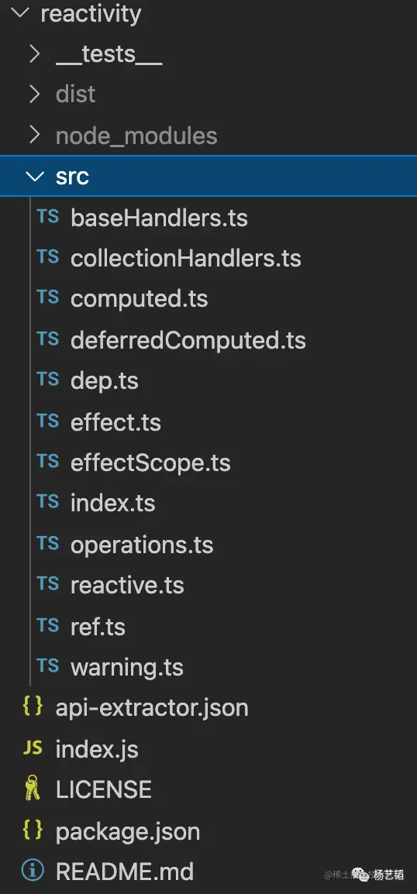
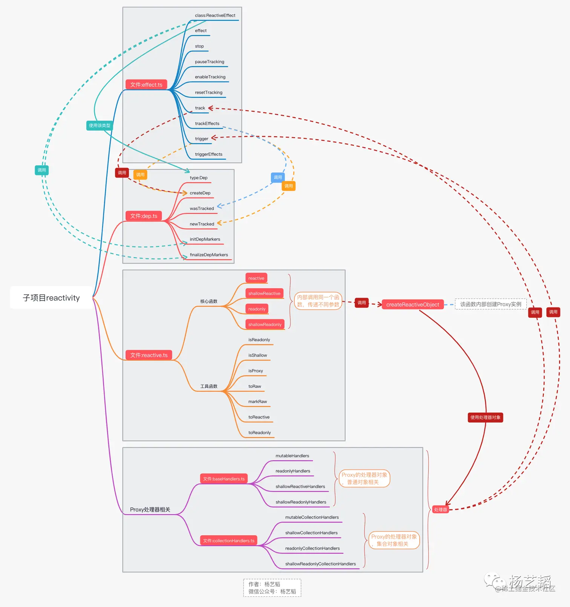

# 04.Vue3响应式系统源码实现1
> 我们在前一篇文章中手写实现了一个极简版的响应式系统，接下来将会开始带着大家分析`reactivity`中的具体实现。关于`reactivity`的源码实现细节分析会通过两篇文章完成。本文将会从观察`reactivity`的代码文件结构开始，并从中选出最核心最重要的几个文件(`reactive.ts、effect.ts、dep.ts、baseHandlers.ts、collectionHanders.ts`)分析其代码关系，接着会分析这其中的一些关键逻辑。在下一篇文章中在探索一些具体`api`的功能以及对应的源码实现细节。

```ts
/******************************************************************/
/*****************     欢迎关注微信公众号：杨艺韬     *****************/
/******************************************************************/
```

# 代码组织结构
我们先来看看`reactivity`由哪些代码文件组成：


从图中可以看出，`reactivity`的具体实现由**12**个代码文件组成。
看过上一篇文章的朋友可能会觉得惊讶，当时极简版的代码是这样的简单，不足**50**行。
没错，当时写的极简版响应式系统仅用少量代码就实现了修改对象的属性，自动触发页面更新的功能。相信**50**行代码和**12**个文件之间的差距不仅仅是边界条件处理那么简单。但是也不用担心，只要抓住了这些文件间的关系就可以消除心中的疑惑，因为根本的原理确确实实就是我们前面手写的极简版。我们先来看看这**12**个文件具体的分工是什么：
```md
reactive.ts-----------------对外提供响应式能力（对象）
ref.ts----------------------对外提供响应式能力（原始类型值）
baseHandlers.ts-------------Proxy处理器（普通对象）
collectionHandlers.ts-------Proxy处理器（集合对象）
effect.ts-------------------响应式对象属性依赖管理器
dep.ts----------------------工具函数

computed.ts-----------------计算属性
deferredComputed.ts---------下一个tick执行的计算属性
effectScope.ts--------------effect相关的一个管理器
index.ts--------------------集合整个库的能力，对外暴露
operations.ts---------------操作类型相关的常量
warning.ts------------------工具函数
```
本文只会涉及上面列出的前**5**个文件。之所以这样安排，是因为这**5**个文件的内容，完整的呈现了响应式系统的工作流程，而且`reactivive.ts`暴露的`reactive`函数在某种程度上可以认为是日常开发中最常用的`api`，理解了上面几个文件中的代码，对于响应式系统剩下的内容就能比较轻松的理解。

如果对这几个文件的分工，此时还是比较疑惑，可以回想一下上一篇文章中实现的极简版响应式系统相关代码：

```html
<!--代码片段1-->
<html>
    <head></head>
    <body>
        <div id="app"></div>
    </body>
    <script>
        const objMap = new Map()
        let activeEffect = null
        const reactive = (obj) => {
            return new Proxy(obj, {
                get: function (target, property) {
                    let propertyMap = objMap.get(target) || new Map()
                    let effectArr = propertyMap.get(property) || []
                    if (effectArr.indexOf(activeEffect) === -1 && !!activeEffect) { 
                        effectArr.push(activeEffect)
                        propertyMap.set(property, effectArr)
                        objMap.set(target, propertyMap)
                    }
                    return target[property] 
                },
                set: function (target, property, val) {
                    target[property] = val
                    let propertyMap = objMap.get(target) || new Map()
                    let effectArr = propertyMap.get(property) || []
                    effectArr.forEach(item => {
                        item()  
                    })
                }
            })
        }
        const effect = (fn) => {
            activeEffect = fn
            fn()
        }

        let dataObj = {name: 'yangyitao'}
        let reactiveDataObj = reactive(dataObj)

        const functionA = () => {
            document.getElementById('app').innerText = reactiveDataObj.name // Id为`anyRealId`的元素真实存在 
        }
        effect(functionA)

        setTimeout(() => {
            reactiveDataObj.name = '杨艺韬'
        }, 3000)
    </script>
</html>
```
我们从极简本中要抓住几个重点：
1. effect函数
2. 调用函数reactive，让普通对象具备响应式能力
3. 创建Proxy对象实例，给Proxy对象设置处理器对象

这个时候我们再回头看我们今天要分析的几个文件，由于`dep.ts`只是一个工具函数，可以暂时忽略。而`collectionHandlers.ts`只是为`Set`、`Map`之类的集合对象添加响应式能力而存在的Proxy处理器对象相关的内容，我们这里也可以暂时忽略，只分析为普通对象添加响应式能力的代码。因此可以先简单的认为：
```md
reactive.ts-----------------极简版中的reactive函数所在的地方
baseHandlers.ts-------------极简版中的创建proxy实例的地方
effect.ts-------------------极简版中的调用effect函数的地方
```
在具体进入代码之前，请先看下面这张思维导图：


此时看这张图片可能会觉得有些复杂，但没关系，分析完本文的内容再回过头相信就会更加容易理解了。
# 函数reactive
按照极简版中的理解，`reactive`函数，就是为某个对象创建一个`Proxy`实例并返回。我们先看看源码中的实现：
```javascript
export function reactive<T extends object>(target: T): UnwrapNestedRefs<T>
export function reactive(target: object) {
  // 此处省略一些次要逻辑...
  return createReactiveObject(
    target,
    false,
    mutableHandlers,
    mutableCollectionHandlers,
    reactiveMap
  )
}

function createReactiveObject(
  target: Target,
  isReadonly: boolean,
  baseHandlers: ProxyHandler<any>,
  collectionHandlers: ProxyHandler<any>,
  proxyMap: WeakMap<Target, any>
) {
  // 此处省略一些次要逻辑...
  const existingProxy = proxyMap.get(target)
  if (existingProxy) {
    return existingProxy
  }
  const targetType = getTargetType(target)
  if (targetType === TargetType.INVALID) {
    return target
  }
  const proxy = new Proxy(
    target,
    //此时暂不考虑集合对象的处理，可以认为该参数值就是baseHandler
    targetType === TargetType.COLLECTION ? collectionHandlers : baseHandlers
  )
  proxyMap.set(target, proxy)
  return proxy
}
```
到目前为止，逻辑和极简版还是高度相似的，只不过这里的`Proxy`实例的处理器相关代码是放在文件`baseHandlers`中维护的。但是，我们会发现在文件`reactive.ts`中除了函数`reactive`，还有函数`shallowReactive`、`readonly`、`shallowReadonly`，这几个函数内部和函数`reactive`一样也调用了`createReactiveObject`，也就是说都最终创建了`Proxy`实例，只不过传入的参数不太一样。
具体这些函数的功能，可以查阅`vue3`的官方文档，就不在此处赘述了。另外`reactive.ts`中还有**7**个工具函数，逻辑相对简单朋友们可以自行阅读，不作为本文重点进行介绍了。

# 函数effect
先看看函数`effect`的具体代码：
```javascript
export function effect<T = any>(
  fn: () => T,
  options?: ReactiveEffectOptions
): ReactiveEffectRunner {
  // 省去一些参处理代码...
  const _effect = new ReactiveEffect(fn)
  // 省去和effectScope相关逻辑以及一些条件判断的代码...
  _effect.run()
  // 省去返回值相关逻辑...
}
```
对该函数代码进行精简后，逻辑很简单，创建一个`ReactiveEffect`实例，并执行其`run`方法。我们来看看类`ReactiveEffect`的代码实现：
```javascript
export class ReactiveEffect<T = any> {
  active = true
  deps: Dep[] = []
  parent: ReactiveEffect | undefined = undefined
  // 省略许多属性声明代码...
  constructor(
    public fn: () => T,
    public scheduler: EffectScheduler | null = null,
    scope?: EffectScope
  ) {
    // 省略代码...
  }

  run() {
    // 省略许多代码...
    return this.fn()
    // 省略许多代码...
  }

  stop() {
    // 省略许多代码...
  }
}
```
去除支持，发现`run`方法只是执行了传入的`fn`这个函数参数并返回结果。也就是说，我们调用`effect`函数，最重要的工作，就是执行了传入的函数参数。朋友们可能会问，执行了又怎么样呢？
## mutableHandlers
还记得我们上面分析`reactive`函数时候提到的`baseHandler`吗，当我们将某个普通对象传入`reactive`的时候，会为该对象创建`Proxy`实例，并设置`baseHandler`，而`baseHander`又做了细致的区分，对于我们调用`reactive`函数而言，其真实的处理器是`baseHandlers.ts`中的`mutableHandlers`，具体代码如下：
```javascript
export const mutableHandlers: ProxyHandler<object> = {
  get,
  set,
  deleteProperty,
  has,
  ownKeys
}
const get = /*#__PURE__*/ createGetter()
const set = /*#__PURE__*/ createSetter()

function createGetter(isReadonly = false, shallow = false) {
  return function get(target: Target, key: string | symbol, receiver: object) {
    // 省略若干代码...
    track(target, TrackOpTypes.GET, key)
    // 省略若干代码...
    return res
  }
}

function createSetter(shallow = false) {
  return function set(
    target: object,
    key: string | symbol,
    value: unknown,
    receiver: object
  ): boolean {
    // 省略若干代码...
    trigger(target, TriggerOpTypes.SET, key, value)
    // 省略若干代码
    return result
  }
}
```
还记得我们在极简版中的响应式系统中，访问对象属性的时候，记录其对应的从`effect`传入的函数，改变对象属性值的时候，遍历记录中的函数依次执行。这个记录和触发的任务在这里交给了`track`和`trigger`，那这两个函数在哪里实现的呢，答案是在`effect.ts`中实现。大家想想为什么要在`effect.ts`中维护这两个函数呢？其实不难理解，`track`收集的是对象属性和对应的`ReactiveEffect`对象实例。我们在极简版中是收集的传给`effect`的函数，这里源码实现中收集的是`ReactiveEffect`对象实例。而`trigger`是遍历对象属性所对应的`ReactiveEffect`实例集合并执行实例的`run`方法。

这时候再回过头看上文中的思维导图，相信就更加容易理解了，如果还是阅读起来有困难可以尝试断点调试，具体调试方法在本系列文章的第**2**篇中有介绍。

# 小结
本文介绍了`reactivity`中的代码文件组成。选取了其中最关键的三个文件`reactive.ts`、`effect.ts`,`baseHandlers.ts`，介绍了`reactive`函数到实现，进而分析了`Proxy`实例的处理器，引出了`track`和`trigger`两个函数。同时也介绍了`effect`函数，涉及了类`ReactiveEffect`最关键的实现。有了这些基础，下一篇文章中，将会讨论一些`reactivity`暴露的具体`api`的功能及其对应的源码细节。

## 写在最后
读完文章觉得有收获的朋友们，可以做下面几件事情支持：
- 如果`点赞，点在看，转发`可以让文章帮助到更多需要帮助的人；
- 如果是微信公众号的作者，可以找我开通`白名单`，`转载`我的原创文章；

最后，请朋友们关注我的`微信公众号: 杨艺韬`，可以获取我的最新动态。