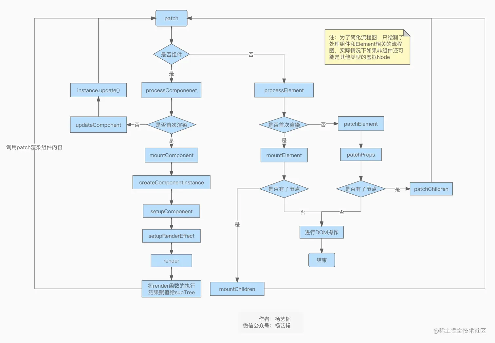

# 09.组件渲染和更新流程
**欢迎关注微信公众号：杨艺韬**

前面我们分析`patch`函数的时候，我们知道了内部通过不同类型的判断来调用不同的函数来比较新旧**虚拟Node**之间的差异并抹平这种差异，当时也介绍了`patch`函数调用的部分函数实现细节。本文会带着大家分析`processElement`和`processComponent`这两个函数的大部分源码实现，并在文末以一张流程图来概括`patch`函数的核心工作流程，至于`diff`函数的具体实现，作为一个难点，将会在下一篇文章中深入讲解。
# processElement
我们先看看`processElement`的代码实现：
```ts
// 代码片段1
const processElement = (
    n1: VNode | null,
    n2: VNode,
    container: RendererElement,
    anchor: RendererNode | null,
    parentComponent: ComponentInternalInstance | null,
    parentSuspense: SuspenseBoundary | null,
    isSVG: boolean,
    slotScopeIds: string[] | null,
    optimized: boolean
  ) => {
    isSVG = isSVG || (n2.type as string) === 'svg'
    if (n1 == null) {
      mountElement(
        n2,
        container,
        anchor,
        parentComponent,
        parentSuspense,
        isSVG,
        slotScopeIds,
        optimized
      )
    } else {
      patchElement(
        n1,
        n2,
        parentComponent,
        parentSuspense,
        isSVG,
        slotScopeIds,
        optimized
      )
    }
  }
```
我们目前暂时只关注`processElement`的前**4**个参数。
1. `n1`: 旧**虚拟Node**；
2. `n2`: 新**虚拟Node**；
3. `container`: **虚拟Node**转化为**真实Node**后将要挂载到的**DOM**元素；
4. `anchor`:**虚拟Node**转化为**真实Node**后将要挂载到的**DOM**元素上的具体哪个位置。

对参数有了了解后，我们来看条件判断：
```ts
// 代码片段2
if (n1 == null) {
      mountElement(
        // 此处省略若干代码...
      )
    } else {
      patchElement(
        // 此处省略若干代码...
      )
    }
```
代码片段**2**表达的含义很简单，如果**旧虚拟Node**为`null`，说明旧节点不存在，也就没必要进行所谓的比较，直接调用函数`mountElement`将**新虚拟Node**也就是参数`n2`所对应的值，挂载到容器节点中即可。如果**旧虚拟Node**不为`null`，说明旧节点是存在的，就需要我们比较二者的差异，并以具备优良性能的代码实现来抹平这种差异，而`patchElement`函数正具备这样的能力。下面我们开始进入到`mountElement`和`patchElement`两个函数内部进行分析。
## mountElement
我们先看看`mountElement`的源码实现：
```ts
// 代码片段3
const mountElement = (
    vnode: VNode,
    container: RendererElement,
    anchor: RendererNode | null,
    parentComponent: ComponentInternalInstance | null,
    parentSuspense: SuspenseBoundary | null,
    isSVG: boolean,
    slotScopeIds: string[] | null,
    optimized: boolean
  ) => {
    let el: RendererElement
    let vnodeHook: VNodeHook | undefined | null
    const { type, props, shapeFlag, transition, patchFlag, dirs } = vnode
    if (
      !__DEV__ &&
      vnode.el &&
      hostCloneNode !== undefined &&
      patchFlag === PatchFlags.HOISTED
    ) {
      el = vnode.el = hostCloneNode(vnode.el)
    } else {
      el = vnode.el = hostCreateElement(
        vnode.type as string,
        isSVG,
        props && props.is,
        props
      )
      if (shapeFlag & ShapeFlags.TEXT_CHILDREN) {
        hostSetElementText(el, vnode.children as string)
      } else if (shapeFlag & ShapeFlags.ARRAY_CHILDREN) {
        mountChildren(
          vnode.children as VNodeArrayChildren,
          el,
          null,
          parentComponent,
          parentSuspense,
          isSVG && type !== 'foreignObject',
          slotScopeIds,
          optimized
        )
      }
      // 此处省略了若干代码...
    }
    // 此处省略了若干代码...
    hostInsert(el, container, anchor)
    // 此处省略了若干代码...
  }
```
`mountElement`内部的实现逻辑是比较丰富了，但为了突出主线，我将回掉**指令**声明周期函数以及处理动画和异步等逻辑相关代码，还有为创建好的`DOM`元素添加属性的逻辑都省略掉了，这些省略的内容会在特定主题的文章中进行阐述。从代码片段**3**中内容，我们可以认为`mountElement`主要完成了下面几项工作：
1. 根据传入的**虚拟Node**创建相应的**真实Node**元素`el`；
2. 如果`el`的子元素为文本，则将文本设置到该元素中，如果子元素为数组，则调用`mountChildren`函数对每一个子元素进行挂载，而挂载到容器就是我们这里创建的`el`，当然如果子元素的子元素仍然是数组，则会不断递归直到没有子元素；
3. 将`el`挂载到`container`元素中。

对于代码片段**3**的第一个`if`条件判断可能让人疑惑：
```ts
// 代码片段4
if (
      !__DEV__ &&
      vnode.el &&
      hostCloneNode !== undefined &&
      patchFlag === PatchFlags.HOISTED
    ) {
      el = vnode.el = hostCloneNode(vnode.el)
    }
```
我们前面说过，所谓挂载就是将创建好的`DOM`元素添加到目标`DOM`节点中。那为什么这里还能在某些条件下进行复用呢，实际上`Vue3`在编译过程中做了静态变量提升，进行了一定程度的优化，才有了这里的判断条件，相关内容会在编译相关的文章中介绍，此处先简单了解即可。
## patchElement
相较于`mountElement`，`patchElement`的逻辑会复杂不少，为什么呢，因为`mountElement`是不存在寻找差异的，只需要根据**虚拟Node**创建元素并挂载到目标节点上即可。而`patchElement`需要找出**新虚拟Node**和**旧虚拟Node**之前的不同，而且还要在性能比较优良的情况下对当前的`DOM`元素进行增加、删出、修改等操作。

鉴于`patchElement`内容较多，即使是关键的内容也不少。为了方便描述，我分几个方面来介绍，介绍相关内容的时候把局部代码以单独的代码块呈现。主要涉及到下面几个方面：
1. `patchElement`的核心逻辑
2. `patchBlockChildren` 与 `patchChildren`各自的职责
3. `patchFlag`

### `patchElement`的核心功能
前面我们提到过`patchElement`的核心功能是寻找差异并抹平差异。但是寻找和抹平什么差异呢？顾名思义`patchElement`操作的对象是`DOM`元素，而一个`DOM`元素其实含有两大块内容，第一块是`DOM`元素自身的各种属性状态；第二块是`DOM`元素的子元素。那`patchElement`其实的核心功能就是利用`patchChildren`和`patchProps`分别寻找和抹平子元素的差异及当前`DOM`元素的属性的差异。由于`Vue3`内部作来优化，所以不一定总是调用`patchChildren`和`patchProps`，也可能是`patchBlockChildren`或其他函数完成相关工作。

当然除了核心功能，还有分支功能，分支功能包括调用**指令**和**虚拟Node**对应的和更新相关的生命周期函数以及一些异步流程的处理，介绍完核心流程，后续会有专门的文章介绍相关内容。

### `patchBlockChildren` 与 `patchChildren`
我们这里只需要知道`patchBlockChildren`和优化相关，相关内容会在后续文章中合适的时机进行介绍，而`patchChildren`本文也不会讲，因为该函数可以说是整个`patchElement`函数的灵魂所在，逻辑比较复杂。众所周知的`diff`算法也会从`patchChildren`函数开始讲起，请大家期待下一篇文章关于`diff`算法的解析。
### `patchFlag`
```ts
// 代码片段5
 if (patchFlag > 0) {
      if (patchFlag & PatchFlags.FULL_PROPS) {
        patchProps(
          el,
          n2,
          oldProps,
          newProps,
          parentComponent,
          parentSuspense,
          isSVG
        )
      } else {
        if (patchFlag & PatchFlags.CLASS) {
          if (oldProps.class !== newProps.class) {
            hostPatchProp(el, 'class', null, newProps.class, isSVG)
          }
        }
        if (patchFlag & PatchFlags.STYLE) {
          hostPatchProp(el, 'style', oldProps.style, newProps.style, isSVG)
        }
        if (patchFlag & PatchFlags.PROPS) {
          const propsToUpdate = n2.dynamicProps!
          for (let i = 0; i < propsToUpdate.length; i++) {
            const key = propsToUpdate[i]
            const prev = oldProps[key]
            const next = newProps[key]
            if (next !== prev || key === 'value') {
              hostPatchProp(
                el,
                key,
                prev,
                next,
                isSVG,
                n1.children as VNode[],
                parentComponent,
                parentSuspense,
                unmountChildren
              )
            }
          }
        }
      }
      if (patchFlag & PatchFlags.TEXT) {
        if (n1.children !== n2.children) {
          hostSetElementText(el, n2.children as string)
        }
      }
    } else if (!optimized && dynamicChildren == null) {
      patchProps(
        el,
        n2,
        oldProps,
        newProps,
        parentComponent,
        parentSuspense,
        isSVG
      )
    }
```
代码片段**5**的内容逻辑还是很清晰的，但是有一点需要提出来，就是形如`patchFlag & PatchFlags.TEXT`的代码，这雨上一篇文章介绍的`ShapeFlags`原理是一致的。我们来看看`PatchFlags`的代码实现：
```ts
// 代码片段6
export const enum PatchFlags {
  TEXT = 1,
  CLASS = 1 << 1,
  STYLE = 1 << 2,
  PROPS = 1 << 3,
  FULL_PROPS = 1 << 4,
  HYDRATE_EVENTS = 1 << 5,
  STABLE_FRAGMENT = 1 << 6,
  KEYED_FRAGMENT = 1 << 7,
  UNKEYED_FRAGMENT = 1 << 8,
  NEED_PATCH = 1 << 9,
  DYNAMIC_SLOTS = 1 << 10,
  DEV_ROOT_FRAGMENT = 1 << 11,
  HOISTED = -1,
  BAIL = -2
}
```
从代码片段**6**中不难发现，`PatchFlags`代表了要操作哪种类型的属性，同时从代码片段**5**结合上一篇文章中关于位运算的介绍，也不难发现变量`patchFlag`可以同时表达多种状态，比如既可以操作`class`属性又可以操作`style`属性等等。
# processComponent
我们先看看`processComponent`函数的源码实现：
```ts
// 代码片段7
const processComponent = (
    n1: VNode | null,
    n2: VNode,
    container: RendererElement,
    anchor: RendererNode | null,
    parentComponent: ComponentInternalInstance | null,
    parentSuspense: SuspenseBoundary | null,
    isSVG: boolean,
    slotScopeIds: string[] | null,
    optimized: boolean
  ) => {
    n2.slotScopeIds = slotScopeIds
    if (n1 == null) {
      if (n2.shapeFlag & ShapeFlags.COMPONENT_KEPT_ALIVE) {
        ;(parentComponent!.ctx as KeepAliveContext).activate(
          n2,
          container,
          anchor,
          isSVG,
          optimized
        )
      } else {
        mountComponent(
          n2,
          container,
          anchor,
          parentComponent,
          parentSuspense,
          isSVG,
          optimized
        )
      }
    } else {
      updateComponent(n1, n2, optimized)
    }
  }
```
这一块逻辑其实和`processComponent`有高的相似度，不同的是对于组件有`keep-alive`相关特性，本文暂不做介绍。接下来我们就进行`mountComponent`和`updateComponent`两个函数中分析其实现。
## mountComponent

我们先进入`mountComponent`函数中去：
```ts
// 代码片段8
const mountComponent: MountComponentFn = (
    initialVNode,
    container,
    anchor,
    parentComponent,
    parentSuspense,
    isSVG,
    optimized
  ) => {
    // 此处省略若干代码...
    const instance: ComponentInternalInstance =
      compatMountInstance ||
      (initialVNode.component = createComponentInstance(
        initialVNode,
        parentComponent,
        parentSuspense
      ))
    // 此处省略若干代码...
    setupRenderEffect(
      instance,
      initialVNode,
      container,
      anchor,
      parentSuspense,
      isSVG,
      optimized
    )
    // 此处省略若干代码...
  }
```
在省略了若干代码后，留下了最关键的代码，体现了`mountComponent`函数的关键的两项工作：
1. 通过函数`createComponentInstance`创建组件实例；
2. 在函数`setupRenderEffect`中为组件实例创建渲染子组件的函数并传给`ReactiveEffect`实例，使该函数能够在响应式数据发生变化的时候重新执行。

接下来我们就进入`createComponentInstance`和`setupRenderEffect`两个函数中一探究竟。

### createComponentInstance
```ts
// 代码片段9
export function createComponentInstance(
  vnode: VNode,
  parent: ComponentInternalInstance | null,
  suspense: SuspenseBoundary | null
) {
  // 此处省略若干代码...
  const instance: ComponentInternalInstance = {
    // 此处省略若干代码...
  }
  // 此处省略若干代码...

  return instance
}
```
我们需要知道，所谓的组件实例实际上就是一个对象，对应代码片段**9**中的对象`instance`。当然既然是组件实例，意味着这里的参数`vnode`代表的**虚拟Node**的类型是组件，接着会将该组件实例作为参数传给`setupRenderEffect`，现在我们进入该函数进行分析。
### setupRenderEffect
先查看相关代码实现：
```ts
// 代码片段10
const setupRenderEffect: SetupRenderEffectFn = (
    instance,
    initialVNode,
    container,
    anchor,
    parentSuspense,
    isSVG,
    optimized
  ) => {
    const componentUpdateFn = () => {
      // 此处省略若干代码...
    }
    const effect = (instance.effect = new ReactiveEffect(
      componentUpdateFn,
      () => queueJob(instance.update),
      instance.scope 
    ))

    const update = (instance.update = effect.run.bind(effect) as SchedulerJob)
    update.id = instance.uid
    // 此处省略若干代码...
    update()
  }
```
代码片段**10**中对逻辑进行了大量精简只留下了最关键的逻辑。不难看出，函数`setupRenderEffect`主要完成了**3**项工作：
1. 定义函数`componentUpdateFn`;
2. 创建`ReactiveEffect`实例，将定义的函数`componentUpdateFn`作为构造函数的参数传入；
3. 把`effect.run.bind(effect)`作为组件实例`instance`的`update`属性的值；

完成这**3**步后会带来什么结果呢？结果就是当函数`componentUpdateFn`中用到的响应式数据发生变化后会被重新执行。我们知道函数`mountComponent`的功能是将组件所对应的`DOM`树挂载到目标节点上。那也就不难知道函数`componentUpdateFn`的核心作用就是将组件实例转化成真实的`DOM`树并把该`DOM`树挂载到容器节点上。至于具体怎么实现，请看下文。
### componentUpdateFn
```ts
// 代码片段11
   const componentUpdateFn = () => {
      if (!instance.isMounted) {
        // 此处省略若干代码...
        if (el && hydrateNode) {
          // 此处省略若干代码...
        } else {
          // 此处省略若干代码...
          const subTree = (instance.subTree = renderComponentRoot(instance))
          // 此处省略若干代码...
          patch(
            null,
            subTree,
            container,
            anchor,
            instance,
            parentSuspense,
            isSVG
          )
          // 此处省略若干代码...
          initialVNode.el = subTree.el
        }
        // 此处省略若干代码...
        instance.isMounted = true
        // 此处省略若干代码...
        initialVNode = container = anchor = null as any
      } else {
        // 此处省略若干代码...
        if (next) {
          next.el = vnode.el
          updateComponentPreRender(instance, next, optimized)
        } else {
          next = vnode
        }
        // 此处省略若干代码...
        const nextTree = renderComponentRoot(instance)
        // 此处省略若干代码...
        const prevTree = instance.subTree
        instance.subTree = nextTree
        // 此处省略若干代码...
        patch(
          prevTree,
          nextTree,
          // parent may have changed if it's in a teleport
          hostParentNode(prevTree.el!)!,
          // anchor may have changed if it's in a fragment
          getNextHostNode(prevTree),
          instance,
          parentSuspense,
          isSVG
        )
        // 此处省略若干代码...
        next.el = nextTree.el
        // 此处省略若干代码...
      }
    }
```
函数`componentUpdateFn`包含了**200**多行代码，代码片段**11**进行了大量的精简。这个函数可以说是组件渲染和更新的灵魂。从顶层的逻辑判断`if (!instance.isMounted) {}else{}`就能直观的感受到，其既处理了**挂载**又处理了**更新**。

#### 挂载相关逻辑
对于挂载操作，函数`componentUpdateFn`处理了服务端渲染的逻辑本文不作讨论。正常情况下，对于挂载的操作主要做了两件事：
1. 调用`renderComponentRoot`函数，将组件实例`instance`转化成子**虚拟Node**树，并赋值给`instance.subTree`，进而调用`patch`函数将该子**虚拟Node**树挂载到目标容器节点上；
2. 执行`initialVNode.el = subTree.el`，将子节点对应的`el`节点赋值给组件**虚拟Node**的`el`属性。

这里需要注意的是，组件类型的**虚拟Node**和`subTree`之间的关系，假设有下面的代码：
```html
// 代码片段12 文件index.vue
<template>
    <App></App>
</template>
```
```html
// 代码片段13 文件App.vue
<template>
    <div>Hello World</div>
</template>
```
我们可以直观的这样理解，组件类型的**虚拟Node**代表的是`<App></App>`，而组件类型的**虚拟Node**的`subTree`代表的是`<div>Hello World</div>`。

##### renderComponentRoot
下面我们进入`renderComponentRoot`探索如何根据组件实例获得`subTree`:
```ts
// 代码片段14
export function renderComponentRoot(
  instance: ComponentInternalInstance
): VNode {
    // 此处省略若干代码...
    if (vnode.shapeFlag & ShapeFlags.STATEFUL_COMPONENT) {
      const proxyToUse = withProxy || proxy
      result = normalizeVNode(
        render!.call(
          proxyToUse,
          proxyToUse!,
          renderCache,
          props,
          setupState,
          data,
          ctx
        )
      )
      fallthroughAttrs = attrs
    }
  // 此处省略若干代码...
  return result
}
```
在省略大量代码后，我们能很轻松的发现，函数`renderComponentRoot`的核心工作是通过一个代理对象调用了组件的`render`函数。为什么要代理对象？答案其实在前面的文章中已经回答过了，其中一个重要原因是对`ref`值的访问不需要再使用`.value`的形式，另一方面可以保护子组件的内容不被父组件随意访问。至于`render`函数的作用我们也在前面的文章中解释过，就不在此处赘述了。
#### 更新相关逻辑
有了上文对挂载逻辑的分析，更新逻辑就显得很简单了。可以概括为下面两步工作：
1. 获取组件新的`subTree`和当前所具备的`subTree`;
2. 调用`patch`函数来进行更新操作。
## updateComponent
我们先来看看`updateComponent`函数的具体实现：
```ts
// 代码片段15
const updateComponent = (n1: VNode, n2: VNode, optimized: boolean) => {
    const instance = (n2.component = n1.component)!
    if (shouldUpdateComponent(n1, n2, optimized)) {
      if (
        __FEATURE_SUSPENSE__ &&
        instance.asyncDep &&
        !instance.asyncResolved
      ) {
        // 此处省略若干代码...
      } else {
        instance.next = n2
        invalidateJob(instance.update)
        instance.update()
      }
    } else {
      // no update needed. just copy over properties
      n2.component = n1.component
      n2.el = n1.el
      instance.vnode = n2
    }
  }
```
有了上文的基础，我们可以说函数`updateComponent`的核心就是执行`instance.update()`。
# 总结
结合上一篇文章，到目前为止我们可以说已经理解了`Vue3`渲染机制的核心工作流程。请大家先看这张流程图：


结合这张流程图和上一篇和本文的内容，我们可以比较清晰的理解将**虚拟Node**转化为**真实Node**的实现过程。敬请朋友们期待下一篇文章关于`diff`算法的描述。

## 写在最后

读完文章觉得有收获的朋友们，可以做下面几件事情支持：
- 如果`点赞，点在看，转发`可以让文章帮助到更多需要帮助的人；
- 如果是微信公众号的作者，可以找我开通`白名单`，`转载`我的原创文章；

最后，请朋友们关注我的`微信公众号: 杨艺韬`，可以获取我的最新动态。
