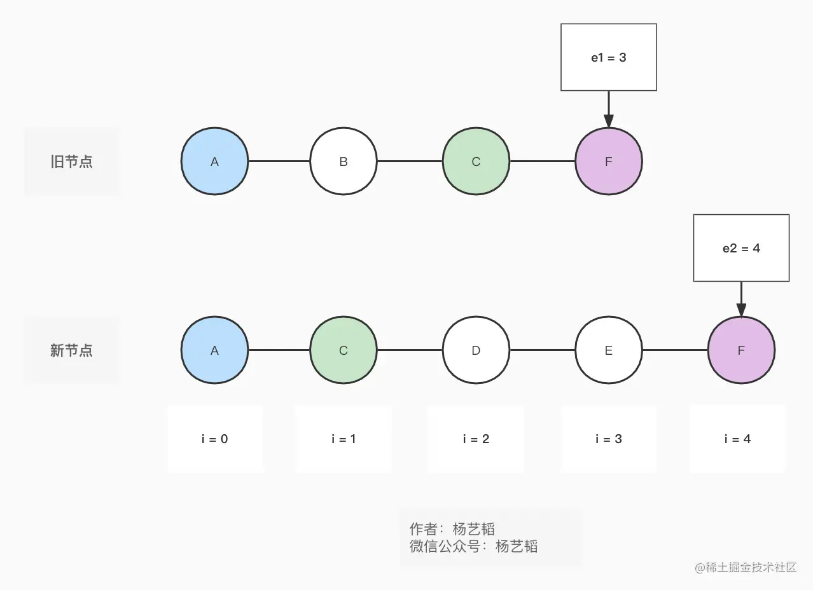
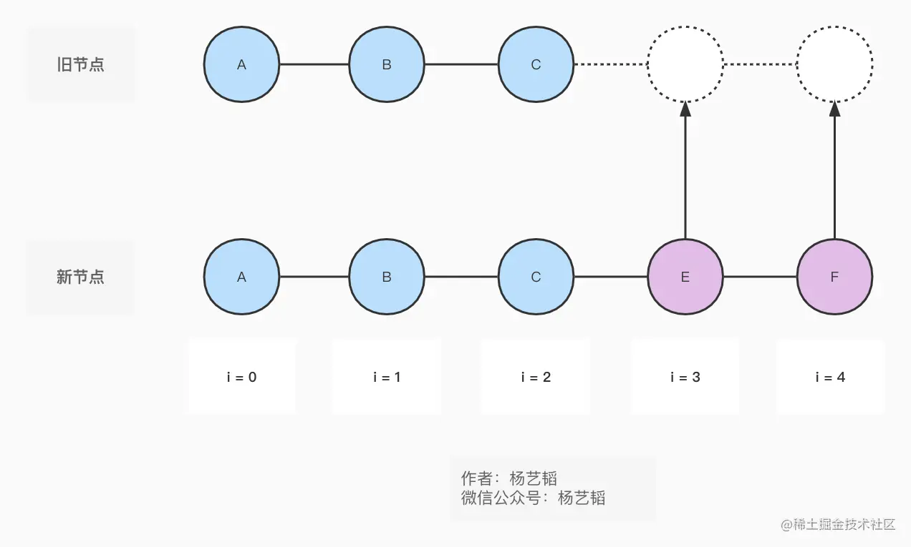
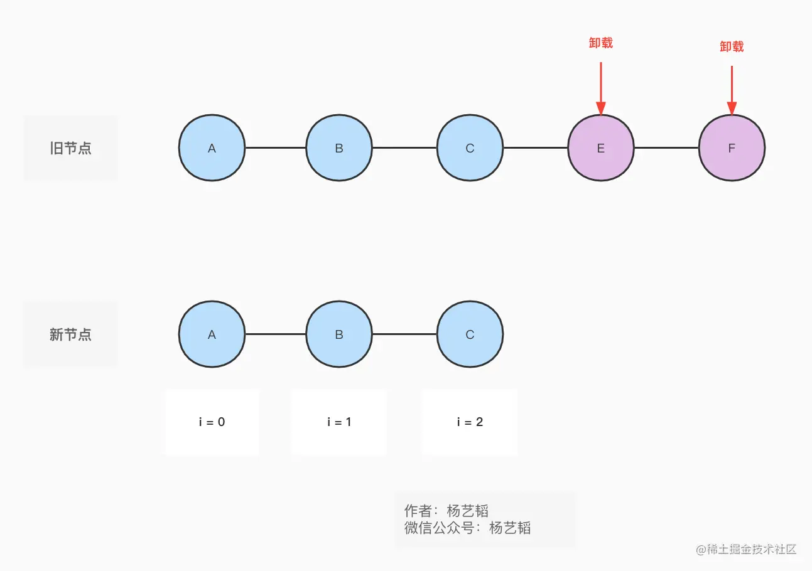

# 10.名动江湖的diff算法

**欢迎关注 微信公众号：杨艺韬**

> 至今不明白为什么**Vue**中的**diff算法**名气这么大，我想说我们不要被事物的表象所迷惑，做技术尤其如此，名气大的事物可能并不一定真的特别重要。就好像谈到**Vue**很多人的第一反应就是响应式系统，似乎**Vue**的核心就是响应式系统。除了响应式系统，很多人对**Vue**印象最深刻的可能就是**diff算法**了，好像**diff算法**就是**Vue**的精髓所在。而实际上响应式系统仅仅是**Vue3**中一个比较重要的子系统罢了，而**diff算法**只不过是**Vue3**这个庞大系统的一个很小的部分，甚至可以说没有**diff**算法，用粗暴的方式仅用几行代码即可替代**diff算法**，还能让**Vue3**依然可以正常工作。当然，**diff算法**是值得我们学习的，毕竟对性能的不断追求是一个开发者的基本素养。

本文会从函数`patchChildren`函数讲起，先让大家理解该函数的核心功能。接着分析**diff**算法的具体实现。

# patchChildren
我们先来看看`patchChildren`函数的内部实现：
```ts
// 代码片段1
const patchChildren: PatchChildrenFn = (
    n1,
    n2,
    container,
    anchor,
    parentComponent,
    parentSuspense,
    isSVG,
    slotScopeIds,
    optimized = false
  ) => {
    const c1 = n1 && n1.children
    const prevShapeFlag = n1 ? n1.shapeFlag : 0
    const c2 = n2.children

    const { patchFlag, shapeFlag } = n2
    if (patchFlag > 0) {
      if (patchFlag & PatchFlags.KEYED_FRAGMENT) {
        patchKeyedChildren(
          c1 as VNode[],
          c2 as VNodeArrayChildren,
          container,
          anchor,
          parentComponent,
          parentSuspense,
          isSVG,
          slotScopeIds,
          optimized
        )
        return
      } else if (patchFlag & PatchFlags.UNKEYED_FRAGMENT) {
        patchUnkeyedChildren(
          c1 as VNode[],
          c2 as VNodeArrayChildren,
          container,
          anchor,
          parentComponent,
          parentSuspense,
          isSVG,
          slotScopeIds,
          optimized
        )
        return
      }
    }

    if (shapeFlag & ShapeFlags.TEXT_CHILDREN) {
      if (prevShapeFlag & ShapeFlags.ARRAY_CHILDREN) {
        unmountChildren(c1 as VNode[], parentComponent, parentSuspense)
      }
      if (c2 !== c1) {
        hostSetElementText(container, c2 as string)
      }
    } else {
      if (prevShapeFlag & ShapeFlags.ARRAY_CHILDREN) {
        if (shapeFlag & ShapeFlags.ARRAY_CHILDREN) {
          patchKeyedChildren(
            c1 as VNode[],
            c2 as VNodeArrayChildren,
            container,
            anchor,
            parentComponent,
            parentSuspense,
            isSVG,
            slotScopeIds,
            optimized
          )
        } else {
          unmountChildren(c1 as VNode[], parentComponent, parentSuspense, true)
        }
      } else {
        if (prevShapeFlag & ShapeFlags.TEXT_CHILDREN) {
          hostSetElementText(container, '')
        }
        if (shapeFlag & ShapeFlags.ARRAY_CHILDREN) {
          mountChildren(
            c2 as VNodeArrayChildren,
            container,
            anchor,
            parentComponent,
            parentSuspense,
            isSVG,
            slotScopeIds,
            optimized
          )
        }
      }
    }
  }
```
代码片段**1**中的逻辑原本是很清晰的，初次看这段代码的朋友可能有些疑惑，不太清楚这里为什么要这么判断，比如第一个条件判断`if (patchFlag > 0) {`，如果没有这个判断其实也是可以正常工作的，实际上这里更多的是为了优化，源码中的注释`fast path`说明了原因。另外，关于`ShapeFlags.ARRAY_CHILDREN`、`ShapeFlags.TEXT_CHILDREN`的逻辑里面也有好几个`if else`语句。其实这里表达的含义是很简单的：
1. 如果新旧**虚拟Node**的子节点都是数组，则执行`patchKeyedChildren`进行比较和更新；
2. 如果**旧虚拟Node**的子节点是数组，但**新虚拟Node**的子节点是文本，则卸载**旧虚拟Node**对应的子节点数组，同时将**新虚拟Node**的文本更新到**DOM**元素上；
3. 如果**新虚拟Node**的子节点既不是数组也不是文本（同时前面也排除了`PatchFlags.KEYED_FRAGMENT`、`PatchFlags.UNKEYED_FRAGMENT`），相当于**新虚拟Node**无子节点，而**旧虚拟Node**的子节点是数组，则只需要进行卸载子节点数组即可；
4. 如果**新虚拟Node**的子节点是数组，而**旧虚拟Node**的子节点是文本，则把文本元素清空，挂载新的子节点数组即可。

接下来我们来进入`patchUnkeyedChildren`和`patchKeyedChildren`两个函数。
# patchUnkeyedChildren
函数`patchUnkeyedChildren`的代码片段如下：
```ts
// 代码片段2
const patchUnkeyedChildren = (
    c1: VNode[],
    c2: VNodeArrayChildren,
    container: RendererElement,
    anchor: RendererNode | null,
    parentComponent: ComponentInternalInstance | null,
    parentSuspense: SuspenseBoundary | null,
    isSVG: boolean,
    slotScopeIds: string[] | null,
    optimized: boolean
  ) => {
    c1 = c1 || EMPTY_ARR
    c2 = c2 || EMPTY_ARR
    const oldLength = c1.length
    const newLength = c2.length
    const commonLength = Math.min(oldLength, newLength)
    let i
    for (i = 0; i < commonLength; i++) {
      const nextChild = (c2[i] = optimized
        ? cloneIfMounted(c2[i] as VNode)
        : normalizeVNode(c2[i]))
      patch(
        c1[i],
        nextChild,
        container,
        null,
        parentComponent,
        parentSuspense,
        isSVG,
        slotScopeIds,
        optimized
      )
    }
    if (oldLength > newLength) {
      // remove old
      unmountChildren(
        c1,
        parentComponent,
        parentSuspense,
        true,
        false,
        commonLength
      )
    } else {
      // mount new
      mountChildren(
        c2,
        container,
        anchor,
        parentComponent,
        parentSuspense,
        isSVG,
        slotScopeIds,
        optimized,
        commonLength
      )
    }
  }
```
其实该函数最原始的逻辑，应该是卸载所有的旧节点，再挂载所有的新节点。只不过框架作者做了优化，还是尽可能去尝试旧的节点是否能复用，这点值得我们学习。
# patchKeyedChildren
大名鼎鼎的**diff**算法，其实就是函数`patchKeydChildren`里面的逻辑。在进入该函数之前，我们先思考为什么会有`patchUnkeyedChildren`和`patchKeyedChildren`两个函数存在，这两者有什么区别？其实最直观的比较，从函数名称可以看出`keyed`、`UnKeyed`，其实这两者的区分就是表示子节点是否有`key`属性来标识。没有`key`属性，比较起来比较复杂，**Vue3**中有一段这样的逻辑：
```ts
// 代码片段3
export function isSameVNodeType(n1: VNode, n2: VNode): boolean {
  if (
    __DEV__ &&
    n2.shapeFlag & ShapeFlags.COMPONENT &&
    hmrDirtyComponents.has(n2.type as ConcreteComponent)
  ) {
    // HMR only: if the component has been hot-updated, force a reload.
    return false
  }
  return n1.type === n2.type && n1.key === n2.key
}
```
如果**虚拟Node**没有`key`属性，则类型相同就认为是同一个节点类型，逻辑上确实没问题，但这样一来，相较于通过`key`属性值直接区分两者不是同一个元素，**新旧虚拟Node**之间的比较会比较频繁。这也就是为什么建议我们在模版中编写诸如`for`循环的代码的时候强烈推荐要具备`key`属性的原因。

函数`patchKeyedChildren`的代码比较多，下面分步骤进行讲解，每一步对应的代码单独放出来。
## 第1步：头比较
```ts
// 代码片段4
// 1. sync from start
// (a b) c
// (a b) d e
while (i <= e1 && i <= e2) {
  const n1 = c1[i]
  const n2 = (c2[i] = optimized
    ? cloneIfMounted(c2[i] as VNode)
    : normalizeVNode(c2[i]))
  if (isSameVNodeType(n1, n2)) {
    patch(
      n1,
      n2,
      container,
      null,
      parentComponent,
      parentSuspense,
      isSVG,
      slotScopeIds,
      optimized
    )
  } else {
    break
  }
  i++
}
```
怎么理解这里的代码呢？可以借助下面的示意图理解：



假设**新旧虚拟Node**如上图所示，执行完代码片段**4**的逻辑后，则节点**A**执行完`patch`操作。相当于后续我们不需要再关心**A**节点，其实这算是一种优化行为，是一个不断缩小后续处理范围的过程。

## 第2步：尾比较
```ts
// 代码片段5
// 2. sync from end
// a (b c)
// d e (b c)
while (i <= e1 && i <= e2) {
  const n1 = c1[e1]
  const n2 = (c2[e2] = optimized
    ? cloneIfMounted(c2[e2] as VNode)
    : normalizeVNode(c2[e2]))
  if (isSameVNodeType(n1, n2)) {
    patch(
      n1,
      n2,
      container,
      null,
      parentComponent,
      parentSuspense,
      isSVG,
      slotScopeIds,
      optimized
    )
  } else {
    break
  }
  e1--
  e2--
}
```
假设**新旧虚拟Node**如上图所示，执行完代码片段**5**的逻辑后，则节点**F**执行完`patch`操作。相当于后续我们不需要再关心**F**节点，这和头比较一样也是一种优化行为，不断缩小后续处理范围。

## 第3步：相同序列 + 挂载
```ts
// 代码片段6
// 3. common sequence + mount
// (a b)
// (a b) c
// i = 2, e1 = 1, e2 = 2
// (a b)
// c (a b)
// i = 0, e1 = -1, e2 = 0
if (i > e1) {
  if (i <= e2) {
    const nextPos = e2 + 1
    const anchor = nextPos < l2 ? (c2[nextPos] as VNode).el : parentAnchor
    while (i <= e2) {
      patch(
        null,
        (c2[i] = optimized
          ? cloneIfMounted(c2[i] as VNode)
          : normalizeVNode(c2[i])),
        container,
        anchor,
        parentComponent,
        parentSuspense,
        isSVG,
        slotScopeIds,
        optimized
      )
      i++
    }
  }
}
```
假设我们目前的新旧节点如下图所示：



执行完代码片段**6**的代码后，相当于，会把多余的新节点`E`,`F`进行挂载操作。

## 第4步：相同序列 + 卸载
```ts
// 代码片段7
// 4. common sequence + unmount
// (a b) c
// (a b)
// i = 2, e1 = 2, e2 = 1
// a (b c)
// (b c)
// i = 0, e1 = 0, e2 = -1
else if (i > e2) {
  while (i <= e1) {
    unmount(c1[i], parentComponent, parentSuspense, true)
    i++
  }
}
```
所谓相同**序列 + 卸载**，如下图所示：


执行完片段**7**的代码后，`E`和`F`节点将会被卸载。

## 第5步：乱序
前面**4**步都是为了提升性能而做的特殊处理，实际上如果不做前面**4**步工作，程序也是可以正常运行的。对于乱序序列的节点，可以分为下面**3**个步骤处理：
### 5.1 记录新节点的Key属性值和索引值的对应关系
```ts
// 代码片段8
const keyToNewIndexMap: Map<string | number | symbol, number> = new Map()
for (i = s2; i <= e2; i++) {
    const nextChild = (c2[i] = optimized
      ? cloneIfMounted(c2[i] as VNode)
      : normalizeVNode(c2[i]))
    if (nextChild.key != null) {
      if (__DEV__ && keyToNewIndexMap.has(nextChild.key)) {
        warn(
          `Duplicate keys found during update:`,
          JSON.stringify(nextChild.key),
          `Make sure keys are unique.`
        )
      }
      keyToNewIndexMap.set(nextChild.key, i)
    }
}
```
代码片段**8**利用`keyToNewIndexMap`比变量存储了所有新节点的Key属性值和索引值的对应关系。

### 5.2 卸载不需要的旧节点，对匹配的新旧节点进行更新
```ts
// 代码片段9
// 5.2 loop through old children left to be patched and try to patch
  // matching nodes & remove nodes that are no longer present
  let j
  let patched = 0
  const toBePatched = e2 - s2 + 1
  let moved = false
  // used to track whether any node has moved
  let maxNewIndexSoFar = 0
  // works as Map<newIndex, oldIndex>
  // Note that oldIndex is offset by +1
  // and oldIndex = 0 is a special value indicating the new node has
  // no corresponding old node.
  // used for determining longest stable subsequence
  const newIndexToOldIndexMap = new Array(toBePatched)
  for (i = 0; i < toBePatched; i++) newIndexToOldIndexMap[i] = 0

  for (i = s1; i <= e1; i++) {
    const prevChild = c1[i]
    if (patched >= toBePatched) {
      // all new children have been patched so this can only be a removal
      unmount(prevChild, parentComponent, parentSuspense, true)
      continue
    }
    let newIndex
    if (prevChild.key != null) {
      newIndex = keyToNewIndexMap.get(prevChild.key)
    } else {
      // key-less node, try to locate a key-less node of the same type
      for (j = s2; j <= e2; j++) {
        if (
          newIndexToOldIndexMap[j - s2] === 0 &&
          isSameVNodeType(prevChild, c2[j] as VNode)
        ) {
          newIndex = j
          break
        }
      }
    }
    if (newIndex === undefined) {
      unmount(prevChild, parentComponent, parentSuspense, true)
    } else {
      newIndexToOldIndexMap[newIndex - s2] = i + 1
      if (newIndex >= maxNewIndexSoFar) {
        maxNewIndexSoFar = newIndex
      } else {
        moved = true
      }
      patch(
        prevChild,
        c2[newIndex] as VNode,
        container,
        null,
        parentComponent,
        parentSuspense,
        isSVG,
        slotScopeIds,
        optimized
      )
      patched++
    }
  }
```
代码片段**9**主要完成了下面几项工作：
1. 遍历旧的子节点序列，卸载那些和所有新节点都不是相同节点的旧节点；
2. 如果新旧节点是相同节点（**key**属性值相同或者`isSameVNodeType`为`true`）则调用`patch`函数进行更新操作；
3. 利用变量`newIndexToOldIndexMap`存储新节点的索引值和对应旧节点的索引值的关系。

### 5.3 对已经更新过的旧节点进行排序并挂载新节点
```ts
// 代码片段10
// 5.3 move and mount
  // generate longest stable subsequence only when nodes have moved
  const increasingNewIndexSequence = moved
    ? getSequence(newIndexToOldIndexMap)
    : EMPTY_ARR
  j = increasingNewIndexSequence.length - 1
  // looping backwards so that we can use last patched node as anchor
  for (i = toBePatched - 1; i >= 0; i--) {
    const nextIndex = s2 + i
    const nextChild = c2[nextIndex] as VNode
    const anchor =
      nextIndex + 1 < l2 ? (c2[nextIndex + 1] as VNode).el : parentAnchor
    if (newIndexToOldIndexMap[i] === 0) {
      // mount new
      patch(
        null,
        nextChild,
        container,
        anchor,
        parentComponent,
        parentSuspense,
        isSVG,
        slotScopeIds,
        optimized
      )
    } else if (moved) {
      // move if:
      // There is no stable subsequence (e.g. a reverse)
      // OR current node is not among the stable sequence
      if (j < 0 || i !== increasingNewIndexSequence[j]) {
        move(nextChild, container, anchor, MoveType.REORDER)
      } else {
        j--
      }
    }
  }
}
```
代码片段**10**根据变量`newIndexToOldIndexMap`保存的**新旧虚拟Node**的索引之间的关系，调用`getSequence`函数获取最长递增子序列。然后保持最长递增子序列对应的元素不动，移动其他已经更新获得旧元素或者挂载新元素，完成所有子节点的更新。
#### getSequence
这里需要知道什么叫最长递增子序列，结合**diff**算法的实际场景：

| 元素1 | 元素2 | 元素3 | 元素4 | 元素5 | 元素6 | 含义 |
| --- | --- | --- | --- | --- | --- | --- |
| 0 |  | 2 | 3 |  | 5 | 旧元素序列可复用元素的索引值 |
|**2** | **3** | **0** | 无 | **5** | 无 | 新元素序列对应的旧元素的索引值 |
| 2 | 3 | 5 |  |  |  | 最长递增子序列 |

从上表中我们得出的最长递增子序列是`2`、`3`、`5`，后续可以对旧元素序列中的索引为`2`、`3`、`5`的元素位置不变，将新元素序列中索引为`2`、`3`的元素插入到索引值为`5`对应的旧元素左边，把新元素序列中索引为`5`的元素插入到索引值为`5`对应的旧元素的右边，就以最小代价(移动和挂载的操作次数最少)完成了所有新旧元素序列的更新。

下面是最长递增子序列的代码实现，是一个纯粹的算法问题，朋友们可以在**leetcode**查阅相关题解，可能和这里有些出入，但是总体实现思路应该大致相同。
```ts
// 代码片段11
// https://en.wikipedia.org/wiki/Longest_increasing_subsequence
function getSequence(arr: number[]): number[] {
  const p = arr.slice()
  const result = [0]
  let i, j, u, v, c
  const len = arr.length
  for (i = 0; i < len; i++) {
    const arrI = arr[i]
    if (arrI !== 0) {
      j = result[result.length - 1]
      if (arr[j] < arrI) {
        p[i] = j
        result.push(i)
        continue
      }
      u = 0
      v = result.length - 1
      while (u < v) {
        c = (u + v) >> 1
        if (arr[result[c]] < arrI) {
          u = c + 1
        } else {
          v = c
        }
      }
      if (arrI < arr[result[u]]) {
        if (u > 0) {
          p[i] = result[u - 1]
        }
        result[u] = i
      }
    }
  }
  u = result.length
  v = result[u - 1]
  while (u-- > 0) {
    result[u] = v
    v = p[v]
  }
  return result
}
```


## 写在最后

读完文章觉得有收获的朋友们，可以做下面几件事情支持：
- 如果`点赞，点在看，转发`可以让文章帮助到更多需要帮助的人；
- 如果是微信公众号的作者，可以找我开通`白名单`，`转载`我的原创文章；

最后，请朋友们关注我的`微信公众号: 杨艺韬`，可以获取我的最新动态。
