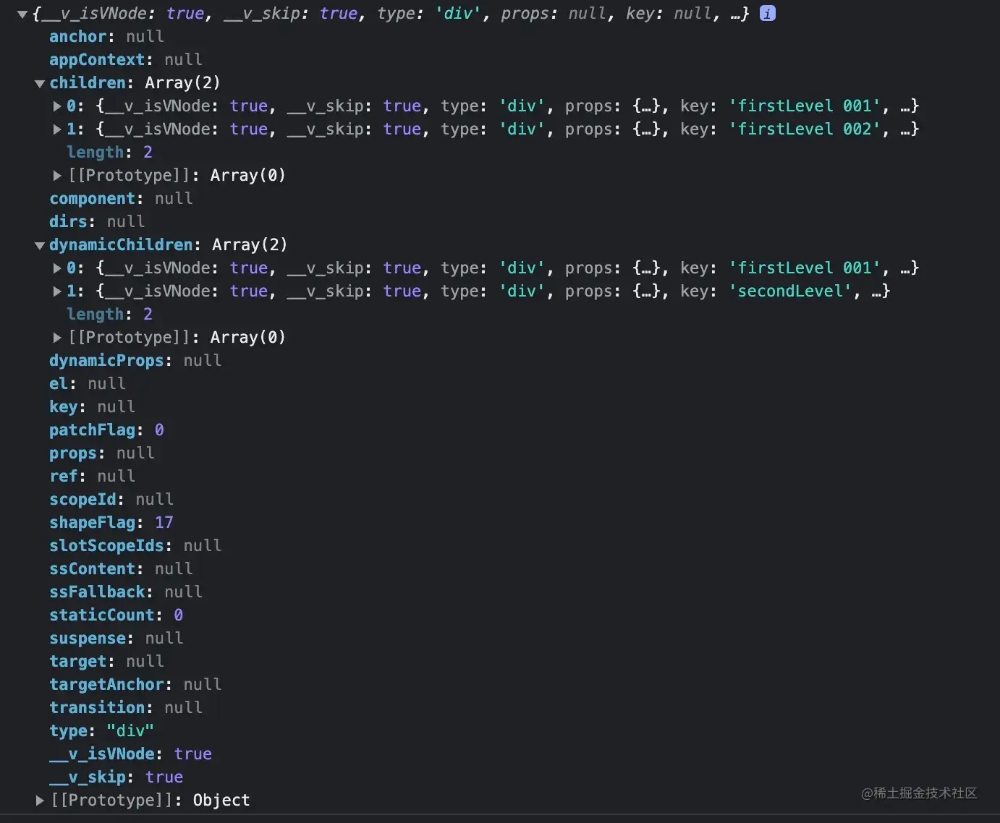

# 11.编译优化之Block Tree 与 PatchFlags
**欢迎关注 微信公众号：杨艺韬**

**Vue3**是一个编译时和运行时相结合的框架。所谓编译时就是把我们编写的模版代码转化成一个`render`函数，该`render`函数的返回结果是一个**虚拟Node**，而运行时的核心工作就是把**虚拟Node**转化为**真实Node**进而根据情况对**DOM树**进行挂载或者更新。前面的文章已经分析了**虚拟Node**转化为**真实Node**的核心流程，但有些细节并没有讲，原因是这些内容和本文的主题**Block Tree**和**PatchFlags**相关，没有这些背景知识很难去理解那些内容。

本文会从一段模版代码开始，并将模版代码和对应的编译结果进行比较，引出**虚拟Node**的`patchflag`属性值，并在`patchflag`机制的基础上，讲解了`dynamicChildren`属性存在的意义，并分析为**虚拟Node**添加`dynamicChildren`属性值的过程，也就是**Block**机制。有了**Block**机制，我们又继续探讨**Block**机制的缺陷，进而又分析**Block Tree**。

# 编译结果
请大家先看一段模版代码：
```html
<!--代码片段1-->
<div>
  <div key="firstLevel 001">firstLevel: {{a}}</div>
  <div key="firstLevel 002">
    <div key="secondLevel">secondLevel: {{b}} </div>
  </div>
</div>
```
我们在网站[https://vue-next-template-explorer.netlify.app/](https://vue-next-template-explorer.netlify.app/)上对代码片段**1**中的代码转化成`render`函数：
```html
<!--代码片段2  文件名：xx.html-->
<script type="module">
    import { toDisplayString as _toDisplayString, createElementVNode as _createElementVNode, Fragment as _Fragment, openBlock as _openBlock, createElementBlock as _createElementBlock, renderList as _renderList, createCommentVNode as _createCommentVNode, createTextVNode as _createTextVNode } from "./runtime-dom.esm-browser.js"

    function render(_ctx, _cache, $props, $setup, $data, $options) {
        return (_openBlock(), _createElementBlock("div", null, [
            _createElementVNode("div", { key: "firstLevel 001" }, "firstLevel: " + _toDisplayString(_ctx.a), 1 /* TEXT */),
            _createElementVNode("div", { key: "firstLevel 002" }, [
                _createElementVNode("div", { key: "secondLevel" }, "secondLevel: " + _toDisplayString(_ctx.b), 1 /* TEXT */)
            ])
        ]))
    }

    let vNode = render({ a: 'a', b: 'b'});
    console.log(vNode)
</script>
```

> 注意：为了方便调试，对编译的结果代码进行了少量改动。代码片段**2**中，第一行代码`import {...} from "./runtime-dom.esm-browser.js"`里面`./runtime-dom.esm-browser.js`是我本地编译的`runtime-dom`的结果文件路径，由于`type="module`的限制，需要开启一个本地服务器，然后在浏览器中访问该`html`页码，在控制台中可以查看打印的调用该`render`函数生成的**虚拟Node**结果。

关于代码片段**2**的内容，大家如果是初次看见肯定会充满疑惑，脑海里会盘旋着诸如下面的问题：`_createElementVNode`是做什么的？`_createElementBlock`又是做什么的？怎么还有个`openBlock`这又是做什么的？还有` 1 /* TEXT */`代表什么含义？

如果此时脑海里充满了这些疑惑，不要着急，接下来将会为大家拨开迷雾，洞察这些充满疑问的地方背后的工作原理。

# render函数概述
至于，代码片段**1**具体是如何转化成代码片段**2**的内容，我们在后面的文章会进行细致的分析。我们先看看这个编译结果`render`函数做了什么事情，或者说这个函数应该做什么事情。其实我们前面的文章中已经提到过，`Vue3`最核心的工作流程就是将模版文件转化为可以返回**虚拟Node**的`render`函数，以及将**虚拟Node**转化成**真实Node**。那代码片段**2**的`render`函数自然就是返回一个**虚拟Node**对象。

此时你可能会回头看代码片段**2**中调用的函数`_createElementVNode`，惊喜的发现，这个函数就是创建**虚拟Node**的函数。但你马上就会感觉奇怪，创建**虚拟Node**这个函数其实就是返回一个对象，这很好理解，这个对象可以描述一个`DOM`节点，而且也不难理解`DOM`节点有子节点，这里的**虚拟Node**也有子**虚拟Node**，所以函数`_createElementVNode`的第三个参数是个数组，这个数组里面的每一个元素都是调用函数`_createElementVNode`来创建的子**虚拟Node**。

到目前为止，这些内容理解起来都毫无压力。但你可能马上大喝一声，不对！我们代码片段**1**中有一个根节点，而代码片段**2**中却都是创建的子节点，根节点谁来创建。我们冷静下来，发现函数`_createElementBlock`的参数和函数`_createElementVNode`的参数几乎是一模一样的，没错，我们可以认为`_createElementBlock`的功能也是创建**虚拟Node**。

到目前为止，我们知道了代码片段**2**的`render`函数的核心任务就是返回**虚拟Node**，并且也知道了所谓的**虚拟Node**其实就是一个描述**DOM**节点的对象，而函数`_createElementVNode`和`_createElementBlock`具备创建该对象的能力。但是毕竟这两个创建**虚拟Node**的函数名称都有差异，那背后肯定也存在着深刻的原因，而这正和本文需要讨论的主题**PatchFlags**和**Block Tree**有着深刻的联系。

# PatchFlags
我们将代码片段**2**中生成的**虚拟Node**从控制台打印截图如下：


从这张图我们可以发现**虚拟Node**有一个属性叫`patchFlag`。
其实在代码中`PatchFlags`代码如下：
```ts
// 代码片段3
export const enum PatchFlags {
  TEXT = 1,
  CLASS = 1 << 1,
  STYLE = 1 << 2,
  PROPS = 1 << 3,
  FULL_PROPS = 1 << 4,
  HYDRATE_EVENTS = 1 << 5,
  STABLE_FRAGMENT = 1 << 6,
  KEYED_FRAGMENT = 1 << 7,
  UNKEYED_FRAGMENT = 1 << 8,
  NEED_PATCH = 1 << 9,
  DYNAMIC_SLOTS = 1 << 10,
  DEV_ROOT_FRAGMENT = 1 << 11,
  HOISTED = -1,
  BAIL = -2
}
```
这些枚举值为什么是以位运算的形式来标识，之前的文章介绍过，本文不再赘述。我们需要知道的是，除了`HOISTED`和`BAIL`，其他所有的值都代表着**虚拟Node**所代表的节点是动态的。所谓动态的，就是可能发生变化的。比如`<div>abc</div>`这样的节点就不是动态的，里面没有响应式元素，正常情况下是不会发生变化的，在`patch`过程中对其进行比较是没有意义的。所以`Vue3`对**虚拟Node**打上标记，如果节点的标记大于`0`则说明是在`patch`的时候是需要比较**新旧虚拟Node**的差异进行更新的。

这时候你可能会说，如果是区分节点是否是动态的，直接打上标记大于`0`或者小于`0`不就行了吗，这里为什么有十几个枚举值来表示？这个问题问得很好，回答这个问题之前我们先问各位另外一个问题，假设让我们来比较两个节点有什么差异，怎么比较呢？

面对这个问题，按照正常的思维，既然要比较两个事物是否有差异，就得看两个事物的各组成部分是否有差异，我们知道**虚拟Node**有标签名、类型名、事件名等各种属性名，同时还有有子节点，子节点又可能有子节点。那么要比较两个**虚拟Node**的差异，就得逐个属性逐级进行比较。而这样必然导致全部属性遍历，性能不可避免的低下。

**Vue3**的作者创造性的不仅标记某个**虚拟Node**是否动态，而且精准的标记具体是哪个属性是动态的，这样在进行更新的时候只需要定向查找相应属性的状态，比如`patchflag`的值如果包含的状态是`CLASS`对应的值`1<<1`，则直接比对**新旧虚拟Node**的`class`属性的值的变化。注意，由于`patchflag`是采用位运算的方式进行赋值，结合枚举类型`PatchFlags`，`patchflag`可以同时表示多种状态。也就是说可以表示`class`属性是动态的，也可以表示`style`属性是动态的，具体原理我们在前面的文章以及解释过，此处不再赘述。

我们发现，虽然对**虚拟Node**已经精准的标记了动态节点，甚至标识到了具体什么属性的维度。但是还是无法避免递归整颗**虚拟Node**树。追求极致的工程师们又创造性的想到了利用**Block**的机制来规避全量对**虚拟Node**树进行递归。

# Block
在解释什么是**Block**机制之前，我们继续思考，如果是我们自己来想办法去规避全量比较**虚拟Node**的话怎么做？可能你会想到，是不是可以把这些动态的节点放到某一个独立的地方进行维护，这样**新旧虚拟Node**的节点可以在一个地方进行比较，就像下面这样：
```html
<!-- 代码片段4-->
<div>
  <div>static content</div>
  <div>{{dynamic}}</div>
  <div>
    <div>{{dynamic}}</div>
  </div>
</div>
```
对应的**虚拟Node**对属性进行精简后大致如下：
```json
// 代码片段4
{
    "type": "div",
    "children": [
        {
            "type": "div",
            "children": "static content",
            "patchFlag": 0
        },
        {
            "type": "div",
            "children": "",
            "patchFlag": 1
        },
        {
            "type": "div",
            "children": [
                {
                    "type": "div",
                    "children": "",
                    "staticCount": 0,
                    "shapeFlag": 1,
                    "patchFlag": 1
                }
            ],
            "staticCount": 0,
            "shapeFlag": 17,
            "patchFlag": 0
        }
    ],
    "patchFlag": 0,
    "dynamicChildren": [
        {
            "type": "div",
            "children": "",
            "staticCount": 0,
            "shapeFlag": 1,
            "patchFlag": 1
        },
        {
            "type": "div",
            "children": "",
            "staticCount": 0,
            "shapeFlag": 1,
            "patchFlag": 1
        }
    ]
}
```
从代码片段**4**中，可以发现**虚拟Node**上有个属性叫`dynamicChildren`，正常一个**虚拟Node**是没有这样一个属性的，因为我们前面说过**虚拟Node**是用来描述**DOM**节点的对象，而**DOM**节点是没有一项信息叫`dynamicChildren`的。那这个属性有什么用呢？还记得我们在分析`patchElemenet`函数的时候吗，有这样一段代码：
```ts
// 代码片段5
if (dynamicChildren) {
      patchBlockChildren(
        n1.dynamicChildren!,
        dynamicChildren,
        el,
        parentComponent,
        parentSuspense,
        areChildrenSVG,
        slotScopeIds
      )
      if (__DEV__ && parentComponent && parentComponent.type.__hmrId) {
        traverseStaticChildren(n1, n2)
      }
    } else if (!optimized) {
      // full diff
      patchChildren(
        n1,
        n2,
        el,
        null,
        parentComponent,
        parentSuspense,
        areChildrenSVG,
        slotScopeIds,
        false
      )
    }
```
当时我叫大家先忽略`patchBlockChildren`函数，只告诉大家该函数和优化相关。我们来看看函数`patchBlockChildren`的具体实现：
```ts
// 代码片段6
// The fast path for blocks.
  const patchBlockChildren: PatchBlockChildrenFn = (
    oldChildren,
    newChildren,
    fallbackContainer,
    parentComponent,
    parentSuspense,
    isSVG,
    slotScopeIds
  ) => {
    for (let i = 0; i < newChildren.length; i++) {
      const oldVNode = oldChildren[i]
      const newVNode = newChildren[i]
      // Determine the container (parent element) for the patch.
      const container =
        // oldVNode may be an errored async setup() component inside Suspense
        // which will not have a mounted element
        oldVNode.el &&
        // - In the case of a Fragment, we need to provide the actual parent
        // of the Fragment itself so it can move its children.
        (oldVNode.type === Fragment ||
          // - In the case of different nodes, there is going to be a replacement
          // which also requires the correct parent container
          !isSameVNodeType(oldVNode, newVNode) ||
          // - In the case of a component, it could contain anything.
          oldVNode.shapeFlag & (ShapeFlags.COMPONENT | ShapeFlags.TELEPORT))
          ? hostParentNode(oldVNode.el)!
          : // In other cases, the parent container is not actually used so we
            // just pass the block element here to avoid a DOM parentNode call.
            fallbackContainer
      patch(
        oldVNode,
        newVNode,
        container,
        null,
        parentComponent,
        parentSuspense,
        isSVG,
        slotScopeIds,
        true
      )
    }
  }
```
该函数的逻辑很简单，对**新旧虚拟Node**的`dynamicChildren`属性所代表的**虚拟Node**数组进行遍历，并调用`patch`函数进行更新操作。

我们从代码片段**5**中可以发现，如果属性`dynamicChildren`有值，则不会执行`patchChildren`函数进行比较**新旧虚拟Node**的差异并进行更新。为什么可以直接比较**虚拟Node**的`dynamicChildren`属性对应的数组元素，就可以完成更新呢？

我们知道`dynamicChildren`中存放的是所有的代表动态节点的**虚拟Node**，而且从代码片段**4**中不难看出`dynamicChildren`记录的动态节点不仅包括自己所属层级的动态节点，也包括子级的动态节点，也就是说根节点内部所有的动态节点都会收集在`dynamicChildren`中。由于**新旧虚拟Node**的根节点下都有`dynamicChildren`属性，都保存了所有的动态元素对应的值，也就是说动态节点的顺序是一一对应的，所以代码片段**6**中不再需要深度递归去寻找节点间的差异，而是简单的线性遍历并执行`patch`函数就完成了节点的更新。

这种机制这么优秀，是如何给属性`dynamicChildren`赋值的呢？

还记得代码片段**2**中，让我们倍感疑惑的函数`_openBlock`和`_createElementBlock`吗。我们来探索这两个函数的内部实现：
```ts
// 代码片段7
export function openBlock(disableTracking = false) {
  blockStack.push((currentBlock = disableTracking ? null : []))
}
```
代码片段**7**中不难发现，所谓的`openBlock`函数，逻辑非常简单，给数组`blockStack`添加一个或为`null`或为`[]`的元素。
```ts
// 代码片段8
export function createElementBlock(
  type: string | typeof Fragment,
  props?: Record<string, any> | null,
  children?: any,
  patchFlag?: number,
  dynamicProps?: string[],
  shapeFlag?: number
) {
  return setupBlock(
    createBaseVNode(
      type,
      props,
      children,
      patchFlag,
      dynamicProps,
      shapeFlag,
      true /* isBlock */
    )
  )
}

function setupBlock(vnode: VNode) {
  // save current block children on the block vnode
  vnode.dynamicChildren =
    isBlockTreeEnabled > 0 ? currentBlock || (EMPTY_ARR as any) : null
  // close block
  closeBlock()
  // a block is always going to be patched, so track it as a child of its
  // parent block
  if (isBlockTreeEnabled > 0 && currentBlock) {
    currentBlock.push(vnode)
  }
  return vnode
}
```
代码片段**8**中调用了一个函数`createBaseVNode`，该函数功能是创建**虚拟Node**对象，这才是`createElementBlock`的核心工作，那这里的函数`setupBlock`发挥了什么作用呢？可以概括为下面**3**个作用：
1. **虚拟Node**创建完成后，给该**虚拟Node**的属性`dynamicChildren`赋值，赋的值为`currentBlock`，我们知道，`currentBlock`是在调用`openBlock`函数的时候初始化的一个数组。
2. 调用`closeBlock`的作用就是将调用`openBlock`时候初始化的数组对象`currentBlock`移除，并将`currentBlock`赋值为`blockStack`的最后一个元素。该函数内容如下：
```ts
// 代码片段9
export function closeBlock() {
  blockStack.pop()
  currentBlock = blockStack[blockStack.length - 1] || null
}
```
3. 执行语句`currentBlock.push(vnode)`，将当前创建的节点自身添加到上一级（因为`closeBlock`的时候已经`pop`出刚刚创建完成的**虚拟Node**所在的`currentBlock`）`currentBock`中。

描述了上面**3**点，可能大家觉得有些疑惑，上面的描述和代码虽然很一致，但是究竟发挥了什么作用呢？我们先将源码实现进行精简，在下文讨论**Block Tree**的时候再回过头看代码片段**7**到代码片段**9**的代码：
```ts
// 代码片段10
export function createElementBlock(
  type: string | typeof Fragment,
  props?: Record<string, any> | null,
  children?: any,
  patchFlag?: number,
  dynamicProps?: string[],
  shapeFlag?: number
) {
  return setupBlock(
    createBaseVNode(/*此处省略若干参数*/)
  )
}

function createBaseVNode(/* ...*/) {
  const vnode = { /* ...*/} as VNode
  if (/*如果是动态元素*/) {
    currentBlock.push(vnode)
  }
  return vnode
}

function setupBlock(vnode: VNode) {
  vnode.dynamicChildren = currentBlock
  return vnode
}
```
将代码精简到极致，其实就是如果是动态节点，就添加到`currentBlock`中，并且在创建完毕**虚拟Node**后，就将`currentBlock`赋值给创建好的**虚拟Node**的`dynamicChildren`属性。注意，通过`createElementBlock`创建的虚拟节点才会为**虚拟Node**添加`dynamicChildren`属性值。

# Block存在的问题
上面我们知道了，`dynamicChildren`的赋值的过程，确实可以让我们更新**DOM**元素的效率提高，但遗憾的是，这里面存在一些问题。问题的关键是，当**DOM**结构不稳定的时候，我们无法通过代码片段**6**中的方式来更新元素。因为要想能通过遍历数组的方式去调用`patch`函数对元素进行更新的前提条件是**新旧虚拟Node**的`dynamicChildren`的元素是一一对应的，因为只有**新旧虚拟Node**是同一个元素进行调用`patch`依次更新才有意义。但是如果**新旧虚拟Node**的`dynamicChildren`元素不能一一对应，那就无法通过这种方式来更新。

然而在我们的程序中包含了大量的`v-if`、`v-else`、`v-else-if`、`v-for`等可能改变**DOM**树结构的指令。比如下面的模版：
```html
<!--代码片段11-->
<div>
    <div v-if="flag">
        <div>{{name}}</div>
        <div>{{age}}</div>
    </div>
    <div v-else>
        <div>{{city}}</div>
    </div>
    <div v-for="item in arr">{{item}}</div>
</div>
```
代码片段**11**中，当`flag`的值不同的时候，收集的动态节点个数是不相同的，同时，不同**虚拟Node**对应的真实**DOM**也是不同的，当我们通过代码片段**6**的方式，直接进行遍历更新是无法生效的。

举个例子，`flag`为`true`的时候，动态节点中包含`{{name}}`所在的`div`和`{{age}}`所在的`div`，而当条件发生改变后，新的**虚拟Node**收集的动态节点是`{{city}}`所在的`div`，当进行遍历比较的时候，会用`{{city}}`所在`div`对应的**虚拟Node**去和`{{name}}`所在的`div`所在的**虚拟Node**进行比较和更新。但是`{{name}}`所在`div`的**虚拟Node**的`el`属性是节点`<div>{{name}}</div>`，然而该节点已经因为条件变化而消失。所以即使对该节点进行更新，浏览器页面也不会发生任何变化。

# Block Tree
为了解决只使用`Block`来提升更新性能的时候所产生的问题，**Block Tree**产生了。所谓的**Block Tree**，其实就是把那些**DOM**结构可能发生改变的地方也作为一个动态节点进行收集。其实代码片段**6**到代码片段**9**之所以维护一个全局的栈结构，就是为了配合**Block Tree**这种机制的正常运转。我们来看一个具体例子：
```html
<!--代码片段12-->
<div>
  <div>
    {{name}}
  </div>
  <div v-for="(item,index) in arr" :key="index">{{item}}</div>
</div>
```
转化成`render`函数：
```ts
import { toDisplayString as _toDisplayString, createElementVNode as _createElementVNode, renderList as _renderList, Fragment as _Fragment, openBlock as _openBlock, createElementBlock as _createElementBlock } from "vue"

export function render(_ctx, _cache, $props, $setup, $data, $options) {
  return (_openBlock(), _createElementBlock("div", null, [
    _createElementVNode("div", null, _toDisplayString(_ctx.name), 1 /* TEXT */),
    (_openBlock(true), _createElementBlock(_Fragment, null, _renderList(_ctx.arr, (item, index) => {
      return (_openBlock(), _createElementBlock("div", { key: index }, _toDisplayString(item), 1 /* TEXT */))
    }), 128 /* KEYED_FRAGMENT */))
  ]))
}
```
我们来看看该`render`函数的返回值，为了方便阅读做了大量精简，关键信息如下：
```json
// 代码片段13
{
    "type": "div",
    "children": [
        {
            "type": "div",
            "children": "yangyitao",
            "staticCount": 0,
            "shapeFlag": 9,
            "patchFlag": 1,
            "dynamicChildren": null
        },
        {
            "children": [
                {
                    "type": "div",
                    "key": 0,
                    "children": "10",
                    "patchFlag": 1,
                    "dynamicChildren": []
                },
                {
                    "type": "div",
                    "key": 1,
                    "children": "100",
                    "patchFlag": 1,
                    "dynamicChildren": []
                },
                {
                    "type": "div",
                    "key": 2,
                    "children": "1000",
                    "patchFlag": 1,
                    "dynamicChildren": []
                }
            ],
            "patchFlag": 128,
            "dynamicChildren": []
        }
    ],
    "patchFlag": 0,
    "dynamicChildren": [
        {
            "type": "div",
            "children": "yangyitao",
            "patchFlag": 1,
            "dynamicChildren": null
        },
        {
            "children": [
                {
                    "type": "div",
                    "key": 0,
                    "children": "10",
                    "patchFlag": 1,
                    "dynamicChildren": []
                },
                {
                    "type": "div",
                    "key": 1,
                    "children": "100",
                    "patchFlag": 1,
                    "dynamicChildren": []
                },
                {
                    "type": "div",
                    "key": 2,
                    "children": "1000",
                    "patchFlag": 1,
                    "dynamicChildren": []
                }
            ],
            "patchFlag": 128,
            "dynamicChildren": []
        }
    ]
}
```
我们可以看见根节点下有`dynamicChildren`属性值，该属性对应的数组有两个元素，一个对应`{{name}}`所在的`div`；一个对应`for`循环的外层节点，该节点的`dynamicChildren`为空元素，这是因为无法保证里面的元素数量上的一致，无法进行通过循环遍历，**新旧虚拟Node**一一对应进行更新，因此只能正常比较`children`下的元素。对于`v-if`、`v-else`等情况和`for`循环有相似之处，大家可以多调试，深入理解相关知识。

 
## 写在最后

读完文章觉得有收获的朋友们，可以做下面几件事情支持：
- 如果`点赞，点在看，转发`可以让文章帮助到更多需要帮助的人；
- 如果是微信公众号的作者，可以找我开通`白名单`，`转载`我的原创文章；

最后，请朋友们关注我的`微信公众号: 杨艺韬`，可以获取我的最新动态。
